# Kanban and Team design/usability audit

Date: 2026-07-13

Scope: current local dashboard build, desktop and 390 × 844 mobile viewport

Method: live interaction review, isolated populated Kanban board, source trace, focused tests, and accessibility spot checks

## Executive verdict

Kanban is not reliable enough for active team work yet. Its visual density is real, but the more urgent problems are behavioral: a filtered-out selection remains in destructive scope, multi-card drag references an undefined symbol, deletion can target the wrong board context, and “add in this column” does not honor most destination columns.

Team renders consistently, but the product promise does not match the experience. It is a read-only, configuration-backed page renderer presented as a shared team workspace. Most of the visible content explains setup state rather than helping a team understand ownership, recency, decisions, or current work.

The strongest foundation is the shared Work model: Board, Graph, and Outline are useful projections of the same tasks. Graph and Outline also have a clearer empty state than Board. The redesign should preserve that model while simplifying navigation, stage visibility, and controls.

## Implementation follow-up

The same branch now resolves the highest-risk and highest-confusion findings:

- The product has one canonical name and route: **Work** at `/work`, with `/kanban` retained as a compatibility redirect. Board, Graph, and Outline are explicit projections inside that surface.
- Board, view, and open task are shareable URL state with Back/Forward support. Route writes remain safe when the dashboard is hosted below a basename such as `/fabric`.
- Hidden bulk selection, undefined multi-drag logic, unscoped deletion, silent drawer errors, card Escape behavior, and create-draft loss are fixed. Unsupported column create affordances are no longer shown.
- The create flow is dismissible without pretending that aborting a POST reverses server work. Stable idempotency keys make response-loss/retry safe, and refresh completes before a newly-created task opens.
- Chat now has a Work rail for choosing or creating a board and opening Graph, Board, or Outline without mutating the CLI's current-board pointer. It refreshes when the persistently mounted Chat route becomes active again.
- Task creation and inspection now have dialog semantics, focus containment/restoration, visible errors, and viewport-safe modal sizing.

Two larger recommendations remain intentionally open: restructuring the eight-stage Board for mobile/scannability, and deciding whether Team should stay honest as read-only Team Pages or grow into an editable operational workspace. Those require a broader product decision rather than a cosmetic patch.

## Walkthrough

1. **Open Team home — Poor.** The shell says “Team,” the page repeats “Team home” at a much larger size, and setup metadata (“Config-ready,” page count, Reload) dominates the first screen. There is no clear team outcome, owner, freshness signal, or primary action.

   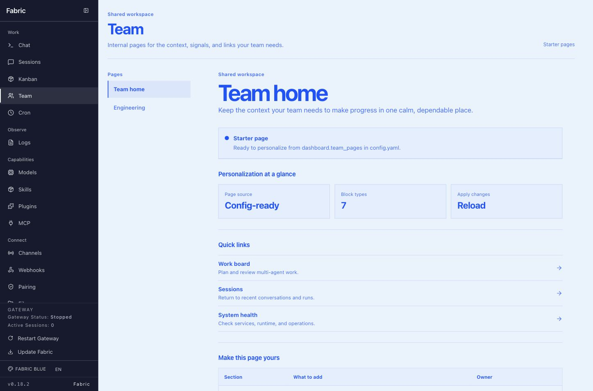

2. **Switch Team pages — Mixed.** Tabs work with pointer and arrow keys, which is good. Selection is only local state/local storage, however: the URL and browser history do not change, so pages cannot be linked, refreshed predictably, or navigated with Back/Forward. Internal links use raw anchors and reload the document.

3. **Open an empty Kanban board — Poor.** Eight fixed-width stages create a 2,383 px horizontal surface inside a 1,159 px viewport. Only about half the workflow is visible, every lane repeats “No tasks,” and Board lacks the useful global empty-state call to action already present in Graph and Outline.

   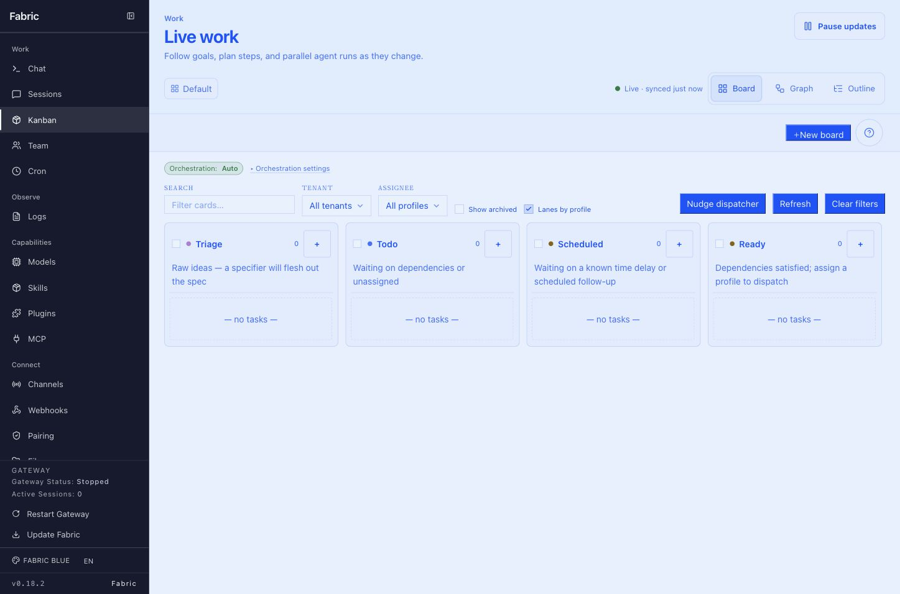

4. **Add a task from a column — Critical.** The compact inline form is dense, relies heavily on placeholders, and provides little context. More importantly, the column promise is false: a live task added from Done appeared in Ready. Failed creation also clears the draft before the rejected request is surfaced.

   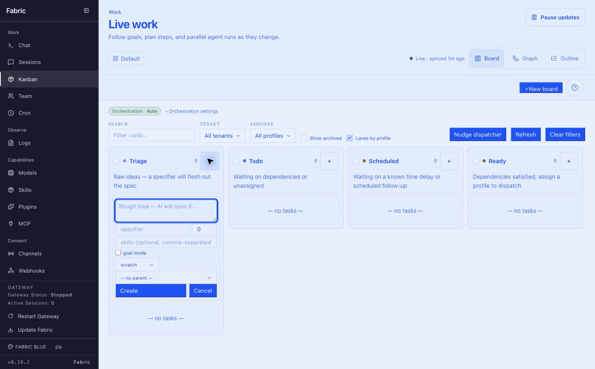

5. **Use Graph and Outline — Mixed.** Both projections are useful and share one data model. Graph is the desktop default, though the sidebar says “Kanban” while the page says “Live work,” creating an expectation mismatch before the board is even used.

   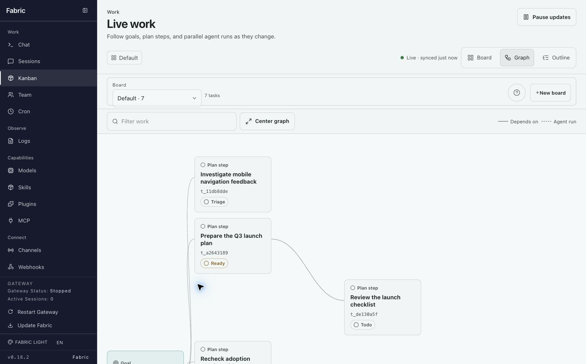

6. **Scan a populated Board — Poor.** Four of eight lanes are visible at once, with no stage map, jump control, or strong indication of what is off-screen. Toolbar actions, orchestration state, filters, and card metadata all compete at similar visual weight.

   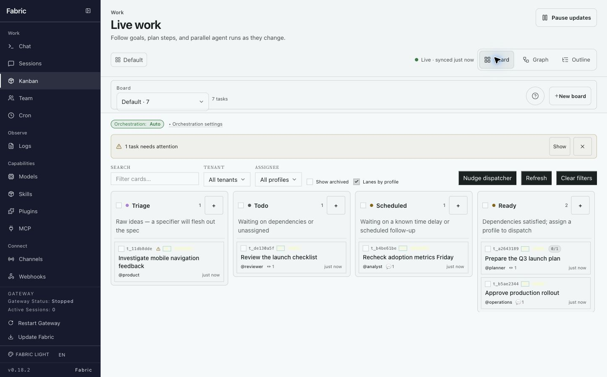

   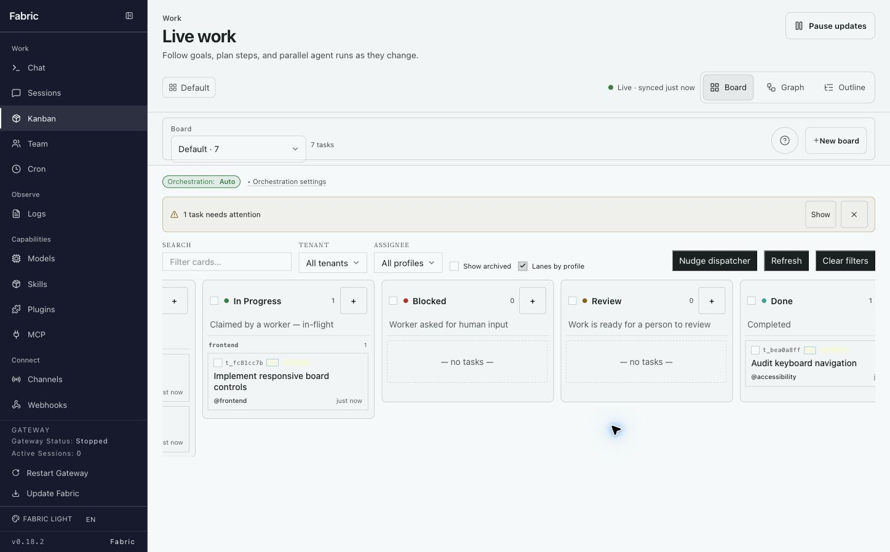

7. **Inspect a task — Poor.** The drawer exposes useful detail, but its action row is dense and it lacks complete dialog/focus behavior. Escape closes it, but focus falls back to the document body instead of the originating card. PATCH failures are stored in state but never rendered, so edits can appear to succeed after an error.

   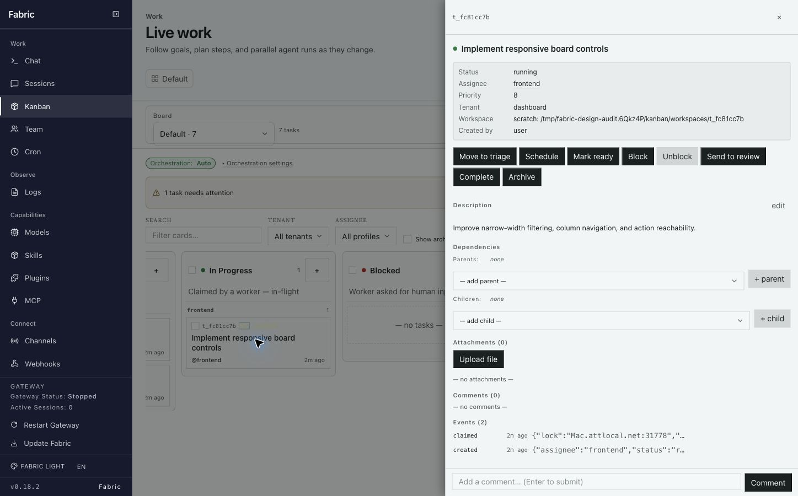

8. **Select a task, then filter it out — Critical.** The selected card disappears, but “1 selected” and destructive bulk actions remain visible and enabled. A user can delete, archive, or complete work they can no longer see. Selection must be reconciled with the visible result set or explicitly disclosed.

   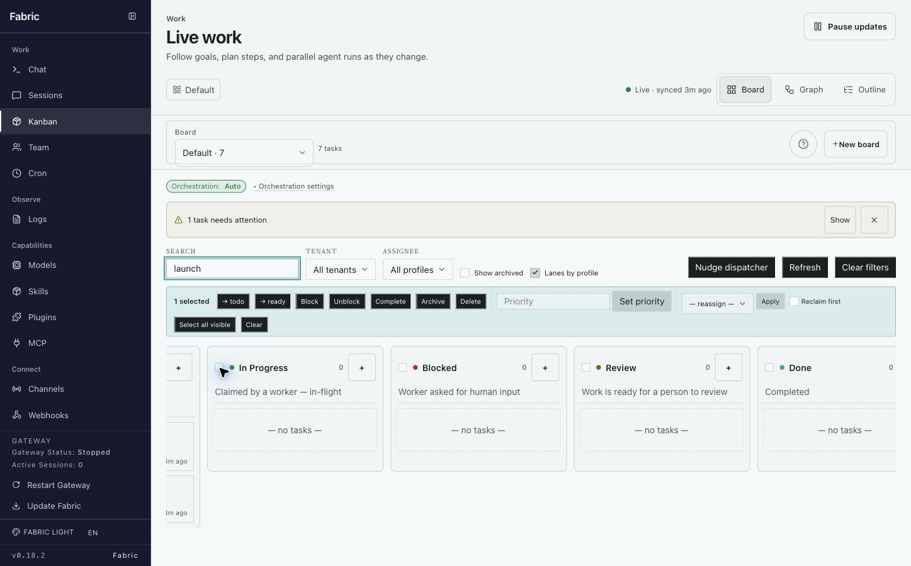

9. **Use Kanban on mobile — Poor.** In Board view, the header, pause state, context, view tabs, board switcher, orchestration, filters, and actions consume nearly the full viewport; no task is meaningfully visible and the next lane is clipped. Outline is materially better, but still carries the same oversized control stack.

   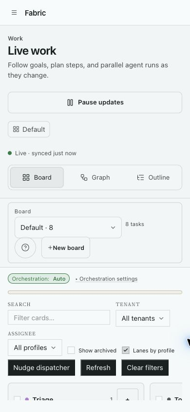

   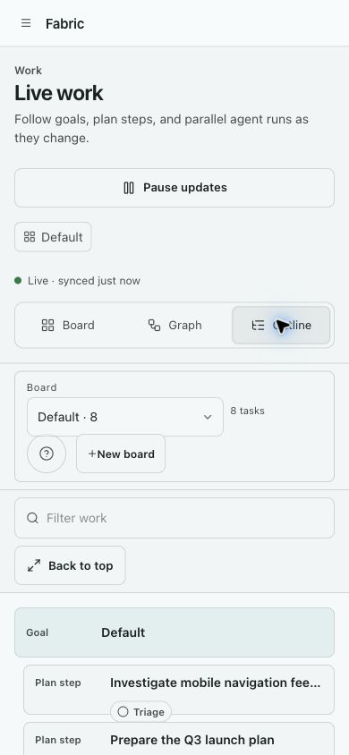

10. **Use Team on mobile — Poor.** Repeated workspace/page headings and setup status consume the first screen. The page tabs overflow horizontally, and the actual team content begins too late.

    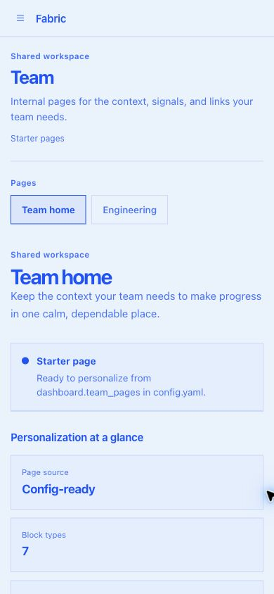

## Ranked findings

### Critical — correctness and safety

1. **Hidden destructive scope.** Selection survives filtering even when selected cards are invisible; bulk actions still operate on the hidden IDs.
2. **Multi-card drag can fail at runtime.** `DESTRUCTIVE_TRANSITIONS` is referenced but never defined in `plugins/kanban/dashboard/dist/index.js:867`. A focused ESLint run confirms `no-undef`.
3. **Delete is not consistently board-scoped.** Single and bulk delete omit the board query parameter even though the backend resolves board context from it. This can fail or act against the current/default board rather than the task's board.

### High — broken promises and information architecture

4. **“Add in this column” does not mean that.** Only Triage gets a special create payload; other column entry points create Ready/Todo tasks because the API body has no general target status.
5. **Failures are silent or destructive.** Drawer PATCH errors are never presented. The inline creator clears entered values before the request outcome is known.
6. **The surface has three names.** Navigation says “Kanban,” the page says “Live work,” and desktop opens Graph. Rename the primary surface to **Work** and treat Board/Graph/Outline as projections, or keep “Kanban” and default to Board.
7. **The board exposes the workflow database, not a scannable work surface.** Eight equal lanes across a wide scroll area have no overview or prioritization. Statuses can remain in the data model without requiring every stage to occupy equal permanent width.
8. **Team is a product-model mismatch.** The implementation is a read-only, profile-scoped config renderer with bundled starter content, but the interface presents it as a shared operational workspace.

### Medium — accessibility and interaction quality

9. **Card semantics conflict.** A button-like card contains a nested checkbox, and Escape on an unselected card toggles it selected.
10. **Drawer focus is not restored.** Add dialog semantics, `aria-modal`, focus trapping, and return focus to the invoking card.
11. **Controls are small and ambiguously labeled.** Column plus icons need contextual names such as “Add task to Ready”; pointer targets should meet the project's 44 px target guidance.
12. **Team tabs need desktop orientation semantics.** Arrow navigation works, but the vertical tablist lacks `aria-orientation="vertical"`; inactive tabs point at panels that are not mounted.
13. **Hierarchy is inverted.** Team's page-level H2 is visually larger than its H1, weakening document and visual hierarchy.
14. **Tables are always keyboard-focusable.** Only make the wrapper focusable when overflow actually requires keyboard scrolling.

## Recommended redesign sequence

1. **Stabilize behavior first.** Fix multi-drag, board-scoped deletes, destination-aware creation, visible error states, draft preservation, filtered selection, and Escape behavior. Add browser-level regression tests for each path.
2. **Unify the Work information architecture.** Use one page name, a compact outcome/freshness header, and Board/Graph/Outline as clearly labeled views. Keep Pause prominent only when it changes execution safety.
3. **Make Board scannable.** Preserve all statuses, but introduce a stage navigator, collapsible secondary lanes, and configurable visible stages. Reduce toolbar priority and move infrequent filters/actions into a disclosure or sheet.
4. **Design mobile around one reading axis.** Default to Outline or a single-stage list; put filters and orchestration controls in a bottom sheet/drawer; keep the first task visible above the fold.
5. **Choose Team's honest product.** If it stays config-driven, call it “Team Pages” and place configuration/setup affordances where admins expect them. If it remains a top-level Team destination, add in-app editing, owners, freshness, validation errors, stable page URLs, SPA navigation, and current operational signals. Setup metadata should not masquerade as team KPIs.
6. **Close the accessibility contract.** Restore focus, separate card and selection semantics, label all icon controls, add tab orientation, validate focus order, and test keyboard, zoom, contrast, and screen-reader output.

## Validation and evidence limits

- Reviewed the current local plugin bundles in the running dashboard.
- Used a separate temporary `FABRIC_HOME` and seeded board; the user's empty Kanban database was not modified.
- Verified desktop behavior and a 390 × 844 mobile viewport.
- Verified Team arrow navigation, drawer Escape behavior/focus loss, hidden selection under filtering, and incorrect column creation live.
- `tests/plugins/test_kanban_dashboard_plugin.py`: 107 passed, with 2 warnings.
- `tests/plugins/test_team_pages_plugin.py`: 4 passed; the Team bundle also passes `node --check`.
- Focused ESLint: one confirmed `no-undef` error for `DESTRUCTIVE_TRANSITIONS`.
- This was not a full screen-reader, contrast-ratio, reduced-motion, browser-matrix, or 200% zoom audit. Those remain required before claiming accessibility compliance.

## Screenshot index

All audit captures are in this folder:

- `01-team-engineering-desktop.png`
- `02-team-home-desktop.png`
- `03-kanban-empty-board-desktop.png`
- `04-kanban-empty-graph.png`
- `05-kanban-empty-outline.png`
- `06-kanban-create-task-inline.png`
- `07-kanban-board-mobile.png`
- `08-team-home-mobile.png`
- `09-kanban-seeded-default-graph.png`
- `10-kanban-seeded-board.png`
- `11-kanban-seeded-board-right.png`
- `12-kanban-task-drawer.png`
- `13-kanban-hidden-selection.png`
- `14-kanban-seeded-mobile.png`
- `15-kanban-seeded-mobile-outline.png`
