<p align="center">
  
</p>

<p align="center">
  <a href="website/docs/index.mdx">Documentation</a> ·
  <a href="apps/desktop/README.md">Desktop app</a> ·
  <a href="SECURITY.md">Security</a> ·
  <a href="CONTRIBUTING.md">Contributing</a> ·
  <a href="LICENSING.md">Licensing</a>
</p>

# Fabric

Fabric is a community-driven agent brain that is plug and play: connect the
models you prefer, the tools you already use, and the channels you already
live in, and one local-first runtime carries your work across all of them
behind a single `fabric` command. It keeps learning new skills from its
community between your sessions — and everything it knows lives on your own
disk.

## For the operators who move the physical world

Fabric is built for the people whose work does not fit in a browser tab — the
ones who run farms and fleets, workshops and warehouses, clinics, kitchens,
and construction sites. The ones who fix the pump before sunrise and file the
paperwork after dark.

Most software was made for people who sit still. Operators keep moving, so
Fabric holds the thread: it remembers where the work stands, watches the
schedule, answers on whatever channel is in reach, and picks up exactly where
you left off. It runs close to the work — on your own hardware, with state on
your own disk, on machines as small as a Raspberry Pi — because the field,
the floor, and the road rarely have a data center nearby.

If your work moves atoms, your software should keep up. Fabric is how it does.

## One brain, many hands

<p align="center">
  
</p>

Every surface talks to the same brain. Start a job from your phone at the
loading dock, check it over messaging from the truck, finish it at the desk —
memory, skills, and work state follow you because they live in one place. The
hands do the work: terminal, browser, computer use, MCP integrations, and
delegated subagents. The brain decides, remembers, and reports back.

## Plug and play

- **A model** — cloud, subscription, or local; swap any time with
  `fabric model`.
- **Skills** — install community skills and curated packs with
  `fabric skills search`; new capabilities land without waiting for a
  release.
- **Tools** — terminal, browser, computer use, MCP servers, media, and remote
  execution connect through one configuration flow.
- **Channels** — the gateway answers on your messaging channels and runs
  scheduled cron jobs while you are away.
- **Surfaces** — one agent core drives the CLI, Ink TUI, desktop app, web
  dashboard, mobile clients, and messaging gateways.

## What's inside

- Persistent memory across sessions, with explicit privacy and write
  controls.
- Durable work: goals, plans, and agent runs live on a kanban work board,
  with board, graph, timeline, and outline views of the same work model.
- Orchestration skills built on real delegation machinery — ensembles,
  fan-out, pipelines, and adversarial verification.
- Live views of [Browser](website/docs/user-guide/features/browser.md#desktop-live-view)
  and [Computer Use](website/docs/user-guide/features/computer-use.md#desktop-live-view)
  activity beside Desktop chat, including an always-on-top window that adds
  no model context or calls.
- Host awareness: `fabric monitor` renders CPU, memory, disk, network, and
  GPU live in the terminal; `fabric disk` shows and safely reclaims
  Fabric's storage.
- Authored Compound Engineering and Product Design capability packs, plus
  venture-studio and orchestration skill categories, in the box.
- Structured design briefs from the desktop or dashboard that continue in
  the same agent conversation.

## Install

Deploying on a single-board computer? See the step-by-step
[Raspberry Pi](website/docs/getting-started/raspberry-pi.md) and
[Jetson Nano](website/docs/getting-started/jetson-nano.md) install guides,
and the [low-memory guide](website/docs/getting-started/low-memory.md) for
the lean 1 GB profile and embedding-free memory options.

Linux, macOS, WSL, and Termux:

```bash
curl -fsSL https://raw.githubusercontent.com/ObliviousOdin/fabric/main/scripts/install.sh | bash
fabric setup
fabric
```

Windows PowerShell:

```powershell
irm https://raw.githubusercontent.com/ObliviousOdin/fabric/main/scripts/install.ps1 | iex
fabric setup
fabric
```

Or install from source:

```bash
git clone https://github.com/ObliviousOdin/fabric.git
cd fabric
uv venv
uv pip install -e '.[all]'
fabric setup
fabric
```

## Everyday commands

```bash
fabric                    # Start an interactive session
fabric --tui              # Start the terminal UI
fabric setup              # Configure providers and services
fabric model              # Select a model or provider
fabric tools              # Configure tools and integrations
fabric skills search      # Find and install community skills
fabric kanban             # Open the durable work board
fabric monitor            # Live host infrastructure monitor
fabric disk usage         # See what Fabric's stores are using
fabric status             # Inspect the active configuration
fabric doctor             # Diagnose installation problems
fabric gateway setup      # Configure messaging channels
fabric gateway start      # Run messaging and scheduled jobs
fabric dashboard          # Open the local dashboard
```

## Choose your models

Run `fabric model` to connect a provider: API-key providers, custom
OpenAI-compatible endpoints, and subscription or OAuth providers including
OpenAI Codex and xAI all live in the same picker.

For local models, install and start [Ollama](https://ollama.com), then:

```bash
fabric ollama pull qwen3:8b
fabric model
```

Workflows that must stay on the machine can enforce a local-only egress
policy.

## Continuously evolving, community driven

Fabric's brain does not freeze at release. The skills index rebuilds twice a
day from a curated, trust-tiered directory of skill sources across the
ecosystem, and every install passes a guard scan and quarantine before
anything runs. Community skill packs, capability packs, and new orchestration
patterns land continuously — update, and the brain you already configured
knows more.

Contributions are welcome: start with [CONTRIBUTING.md](CONTRIBUTING.md) for
setup and project structure, and [AGENTS.md](AGENTS.md) for architecture and
the contribution rubric.

## Development

```bash
git clone https://github.com/ObliviousOdin/fabric.git
cd fabric
uv venv
uv pip install -e '.[dev,all]'
scripts/run_tests.sh
```

The Python runtime, desktop app, web dashboard, TUI, skills, plugins, and
documentation live in this repository. Licensing and attribution details live
in [LICENSING.md](LICENSING.md).
