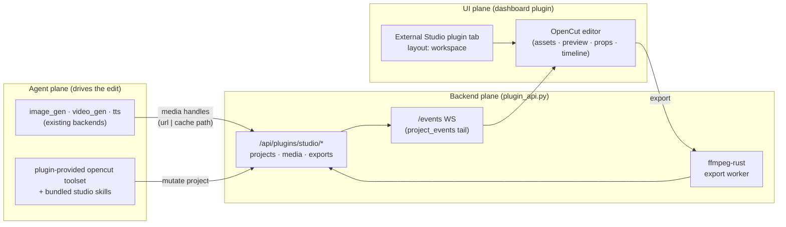

# OpenCut design audit & Fabric embedding proposal

> Status: reviewed proposal + host-readiness implementation (2026-07-15). This document audits the design of
> every page of [OpenCut](https://github.com/OpenCut-app) and proposes how to
> embed OpenCut into Fabric as a first-class **capability**. It is a decision
> input, not an implementation spec — OpenCut-specific code sketches are
> illustrative starting points for a standalone plugin repository. The Fabric
> host changes recorded in §5.7 are implemented by this release.

## 0. TL;DR

- **OpenCut is two codebases.** The live product at `opencut.app` is
  **`OpenCut-app/opencut-classic`** (Next.js App Router), which has 11 real
  pages including the crown-jewel `/editor/[project_id]`. The current
  **`OpenCut-app/OpenCut`** repo is a *ground-up rewrite* (Vite + TanStack
  Router + React 19 + Tailwind v4 + Base UI) that today is only a "hello world"
  landing — but it telegraphs a deliberate design re-platform.
- **Two design languages.** Classic = bright **sky-blue accent**
  (`hsl(200 90% 52%)`), Inter on a small type scale, a dense four-quadrant NLE.
  Rewrite = **monochrome greyscale + Playfair Display serif headings**, no
  colour accent — stark editorial. *Do not hard-code the sky-blue into any
  Fabric integration; target the token layer.*
- **The audit** covers all 11 classic pages + the rewrite direction. Across the
  product we found a consistent story: **excellent engineering and token
  discipline in the editor, undercooked non-happy-path states everywhere**
  (missing/weak empty·loading·error states), **hover-only affordances** that die
  on touch and keyboard, a handful of **hard-coded-colour token violations**
  (the glossy Export button, the roadmap status badges), and **sub-44px touch
  targets**. 98 findings total (22 high / 46 medium / 30 low).
- **The embedding thesis.** Fabric already generates media (`video_gen`,
  `image_gen`, `tts`) and returns it as normalized handles, but there is **no
  timeline / composition / project primitive** anywhere in the stack. That gap
  is exactly what OpenCut fills: **OpenCut becomes Fabric's assembly & export
  layer**, where agent-generated clips, images, narration, and captions are
  composed into a finished video — all local-first, matching both products'
  ethos.
- **The recommendation.** Ship OpenCut as a **standalone dashboard plugin
  repository ("Studio")** installed with `fabric plugins install owner/repo`.
  It contributes a `layout: workspace` tab, its own gated `opencut` toolset,
  and bundled workflow skills while consuming Fabric's public plugin SDK. This
  keeps the third-party product outside Fabric's core tree and preserves the
  narrow-waist/tool-schema contract.
- **Method note.** `opencut.app` is blocked by this environment's egress policy,
  so this audit is **source-driven** (reading the actual `.tsx`/CSS from GitHub)
  and corroborated by published reviews — not live screenshots. Findings cite
  real code (Tailwind classes, component structure, copy).

---

## 1. Method & scope

| | |
|---|---|
| **Sources** | `OpenCut-app/opencut-classic` (live product, Next.js) and `OpenCut-app/OpenCut` (rewrite) source, read directly from `raw.githubusercontent.com`; Fabric's own `web/`, `plugins/`, `capability-packs/`, `apps/desktop/`, `docs/design/`. |
| **Pages audited** | landing (+ global header/footer), projects, editor shell, editor timeline, editor preview, blog, contributors, roadmap, changelog, brand, sponsors, legal (privacy + terms); plus the rewrite landing/tokens. |
| **Lens** | Layout/IA, visual style, typography, colour & token adherence, component patterns, UX strengths, UX issues (severity-ranked with concrete fixes), accessibility, and *embed relevance* to Fabric. |
| **Constraint** | Live site unreachable (proxy egress policy denies `opencut.app:443`); no rendered screenshots. Everything below is grounded in source. |
| **Fabric target contract** | `web/DESIGN.md` "Woven Operations": restrained purple `#4628CC`, warm neutral canvas, system sans, mono *only* for technical values, ledger sections over card grids, thread/bracket/woven motifs, ≥44px targets, plugins consume host semantic tokens. |

---

## 2. OpenCut's design system (as-built)

### 2.1 Classic (the live product)

- **Accent:** one confident sky-blue `--primary: hsl(200 90% 52%)` on
  white/near-black neutrals; pale-blue `secondary` tints; semantic
  `destructive` (red), `constructive` (green), `caution` (amber). The accent is
  used *sparingly and correctly* — usually only on the primary CTA.
- **Editor context:** a `.panel` class remaps neutrals to a slightly warmer grey
  for editor chrome; full `.dark` support; theme-aware imagery via
  `invert dark:invert-0`.
- **Type:** Inter on a deliberately small custom scale (`--text-base: 0.92rem`,
  `--text-xs: 0.72rem`); radii `sm .35 / md .65 / lg .82 rem`.
- **Primitives:** shadcn/Radix + Base UI, `class-variance-authority`, Hugeicons +
  lucide-react. Token discipline is high — most pages route through semantic
  tokens rather than raw hex, which is *why a global re-skin is feasible*.

### 2.2 Rewrite (the signalled direction)

- Monochrome **oklch greyscale** (every chart/border/accent token is chroma-0 —
  i.e. **no colour accent**; `--primary` is near-black), **Inter body + Playfair
  Display serif headings**, radius `.625rem`, shadcn "base-mira".
- The strategic read: OpenCut is moving *away* from the approachable blue SaaS
  look toward **stark editorial monochrome**. (Two token bugs already visible: a
  leftover blue `--sidebar-primary` in dark, contradicting the monochrome
  intent.)

> **Implication for Fabric:** the classic pages already funnel nearly everything
> through semantic tokens, so restyling OpenCut to Fabric's `#4628CC`-on-warm-
> neutral *Woven Operations* palette is mostly a token-remap, not a rewrite. And
> because OpenCut itself is de-emphasising its accent, adopting Fabric's palette
> is *with* the grain of where OpenCut is going, not against it.

---

## 3. Page-by-page audit

### 3.1 Inventory & embed-relevance

| Page | Route | Role | Embed relevance | Top issue |
|---|---|---|---|---|
| **Landing** | `/` | Marketing splash → `/projects` | ✗ strip (no acquisition funnel inside Fabric) | Hero text on full-bleed image, no scrim → contrast fails |
| **Projects** | `/projects` | Local project hub (CRUD, grid/list) | ★ mount point / handoff seam | No storage/quota signal; inconsistent create-path error handling |
| **Editor shell** | `/editor/[id]` | Resizable NLE workspace | ★★★ the capability | Glossy Export button hard-codes hex; needs an "embedded" mode |
| **Timeline** | editor | Track/clip temporal surface | ★★★ agent/human co-edit surface | No empty state; pointer-only, no semantic action layer |
| **Preview** | editor | WebGPU playback canvas | ★★ human-in-loop verification | `renderingRef` deadlocks on render reject; no error state |
| **Blog** | `/blog` | Marketing/SEO list | ✗ strip (data, not UI) | Unwrapped `No posts yet` conflates empty vs error |
| **Contributors** | `/contributors` | Community credits | ✗ strip (runtime GitHub fetch) | Rate-limit → silent "0 contributors" |
| **Roadmap** | `/roadmap` | Transparency page | ○ data only (feature readiness) | Status badges hard-code `bg-*-500!`; yellow/white fails AA |
| **Changelog** | `/changelog` | Release timeline | ○ data only (version signal) | OG image path typo; no empty state |
| **Brand** | `/brand` | Press kit | ✗ strip (but licence matters) | Copy/download actions hover-only → unusable on touch |
| **Sponsors** | `/sponsors` | Thank-you wall | ✗ strip | `group-hover:underline` with no `group` → dead affordance |
| **Legal** | `/privacy`,`/terms` | Trust pages | ⚠ actively misleading if embedded | Env-specific claims (Databuddy/Vercel) false inside Fabric |

★ = load-bearing for embedding · ○ = data useful, UI not · ✗ = exclude from embed · ⚠ = must be overridden.

### 3.2 The editor (the part that matters)

The editor is genuinely well-built and is the *only* surface Fabric needs to
embed. Highlights from the audit:

**Editor shell** (`/editor/[project_id]`) — a fixed `h-screen/w-screen` flex
column: optional degraded-renderer banner, a `h-[3.4rem]` header, then a
two-level `ResizablePanelGroup` (top row = assets ‖ preview ‖ properties;
bottom = timeline), with **layout sizes persisted** to a panel store.

- *Strengths:* correct, learnable NLE IA (rails/stage/timeline); resizable panels
  with persisted layout and sensible min/max clamps; properties panel handles
  zero/multi/single selection explicitly; an honest, progressive Export popover
  (collapsible Format/Quality/Audio, live progress + Cancel, a real failure state
  with copy-error + retry); a graceful mobile *gate* rather than a broken layout;
  polished inline project-name editing (select-on-focus, Enter-commit,
  Escape-revert).
- *Issues:* the primary **Export button hard-codes hex gradients**
  (`#38BDF8/#2567EC/#37B6F7`) and `text-white` with skeuomorphic gloss —
  bypassing `--primary`, can't theme, clashes with the flat shadcn language
  (**high**). A visible **copy bug**: the multi-select message renders
  `"{n} elements selected.0"` (**high**). Project actions hide behind an
  unlabelled logo dropdown; "coming soon" tabs are bare left-aligned text with no
  shared empty component; the mobile gate reads `window.innerWidth` once with no
  resize listener.

**Timeline** — the highest-complexity surface, and the best-engineered.

- *Strengths:* **scroll-sync is engineered, not bolted on** (one non-passive
  capture wheel listener owns all input, coalesces zoom into rAF, syncs ruler +
  labels before paint); industry-standard gestures (`⌘`-wheel zoom, shift-scroll,
  exponential zoom with a per-frame cap); **view-state persists** (zoom, scroll,
  playhead restored per project — strong local-first continuity); edge
  auto-scroll during drag; mute/hide with immediate red `text-destructive`
  feedback and dual entry points.
- *Issues:* **no empty state** — a brand-new project shows a blank ruled grid
  with zero guidance (**high**); **no loading/error state** — a null/loading
  scene is indistinguishable from a genuinely empty one (**medium**); 16px
  (`size-4`) mute/hide controls are non-`button` spans, well under target size,
  no `aria-pressed` (**medium**); all editing intent is **pointer geometry** —
  no keyboard model and no semantic action layer (**high for agent use**); the
  `[...overlay, main, ...audio]` track-flatten + expansion-height logic is
  copy-pasted across three components (drift risk).

**Preview** — a clean WebGPU compositor host.

- *Strengths:* zero-copy canvas mount; frame-deduped render loop; normalized,
  rAF-coalesced wheel input; principled two-plane overlay z-order; correct
  `min-h-0 min-w-0` overflow hygiene.
- *Issues:* **no empty/loading/error state** — a WebGPU-init failure leaves a
  blank framed rectangle (**high**); **`renderingRef` is only reset in
  `.then()`** so a render *rejection* wedges the RAF loop forever (**high** —
  fix with `.finally`); pan/zoom is wheel-only with no visible zoom/fit control
  and no keyboard path.

### 3.3 Projects hub

The natural mount point and agent handoff seam. Thorough interaction model
(shift-range multi-select, indeterminate select-all, context menu + hover
dropdown parity, name-bearing delete confirmation, a 24-card skeleton,
context-aware empty states, one-click create → `router.push('/editor/[id]')`).
Its gaps matter *most* for embedding:

- **No storage/quota UI** at all — for a local-first editor whose media fills
  origin storage, an agent bulk-creating projects could silently exhaust quota
  with zero signal (**high**). Add a `navigator.storage.estimate()` meter.
- **Inconsistent error handling** — the empty-state create path has try/catch +
  toast, but the *primary* `NewProjectButton` does not; duplicate/delete/rename
  are fire-and-forget with no catch, no success toast, no pending state
  (**high**). Agents need failure signals, not silent rejects.
- Four different horizontal gutters across header/toolbar/grid (visible column
  misalignment); no page-level title/count; near-invisible `bg-primary/5`
  selection tint; no `max-width` so the grid stretches edge-to-edge on wide
  monitors.

### 3.4 Marketing, content & utility pages (brief)

These would all be **stripped** from an embed; the notable design issues are
worth fixing in OpenCut itself and instructive for Fabric:

- **Landing:** ruthless single-CTA focus and correct `100svh` fold math, but
  hero copy sits on a full-bleed screenshot **with no scrim** → uncontrolled
  contrast (**high**); two labels for the same destination ("Try early beta" vs
  "Projects") (**high**); a hard `rgba(0,0,0,1)` header shadow; a right-click-only
  logo menu with no keyboard/touch path.
- **Roadmap:** biggest token violation in the product — `StatusBadge` hard-codes
  `bg-green-500!/bg-yellow-500!/bg-blue-500!` with `!important`, and yellow-500 +
  white text fails AA at ~1.9:1 (**high**). Phases aren't an `<ol>`; `h1→h3`
  skips `h2`.
- **Contributors:** runtime server-side `fetch` to `api.github.com` with ISR;
  the unauthenticated 60-req/hr limit makes the (missing) empty state routine →
  "0 contributors" (**high**). A runtime network dependency a local-first embed
  can't assume.
- **Blog / changelog / sponsors / brand:** a recurring tell — `justify-between`
  or `group-hover:*` used on containers with a single child / no `group`, i.e.
  **layout primitives wired for content or states that were never built**;
  unwrapped bare-string empty/error states; hover-only actions (brand
  copy/download) that are unreachable on touch and produce invisible focus
  targets.
- **Legal:** the strongest local-first *copy* in the product (on-device
  processing, IndexedDB, no upload, user owns content) — reusable as capability
  trust messaging — but the analytics/hosting/"we'll notify you on GitHub"
  claims are **environment-specific to `opencut.app` and become false inside
  Fabric** (**must override**). No shared legal layout; the friendly TL;DR
  accordion is collapsed by default.

---

## 4. Cross-cutting findings

**Recurring weaknesses (fix once, everywhere):**

1. **Non-happy-path states are the systemic gap.** Nearly every surface — editor
   timeline, preview, projects create-path, blog, changelog, contributors,
   sponsors — is missing or bare on **empty / loading / error**. For a
   stand-alone app this is polish debt; for an **agent-driven** embed it is a
   correctness problem: an autonomous loop needs a distinguishable,
   machine-readable "no media" vs "still loading" vs "render failed" signal, not
   a blank rectangle or a bare `<div>No posts yet</div>`.
2. **Hover-only affordances.** `opacity-0 group-hover:opacity-100` actions (brand
   copy/download, project card menu/checkbox) and `hover:opacity-75/underline`
   link cues are invisible on touch, unreachable/duplicated for keyboard, and
   create invisible-but-focusable tab stops (WCAG 2.4.7).
3. **Token violations concentrate in a few spots.** The product is mostly
   token-clean, but the **Export button** (hard-coded gloss hex) and the
   **roadmap badges** (`bg-*-500!`) are the exceptions — and they're exactly the
   elements that won't retheme when embedded.
4. **Accessibility: pointer-and-mouse-first.** 16–36px targets below the 44px
   guideline; focus rings that are a mid-grey `--ring` (nearly invisible over
   imagery); no `prefers-reduced-motion` gating; icon-only controls without
   labels; the timeline/preview have no keyboard model.
5. **Dead/aspirational code.** Unused `SearchBar collapsed` variant, inert
   `animationDelay` with no keyframe, unused `info`/`icon` union members — small
   but they signal unfinished intent and mislead maintainers.

**Genuine strengths (keep / build on):**

- High overall **token discipline** → cheap to re-skin.
- **Editor engineering is excellent** — scroll-sync, view-state persistence,
  resizable persisted layout, decoupled headless render-tree controller,
  progressive export with real cancel/failure states.
- **Store-driven architecture** — the editor is driven by a single `EditorCore`
  store (`editor.project.createNewProject / renameProject / deleteProjects /
  duplicateProjects / getFilteredAndSortedProjects / getTimelineViewState`),
  a clean *imperative* surface. This is the single most important fact for
  embedding: **an agent can drive edits by calling the store, not by
  synthesising mouse events.**

---

## 5. Embedding OpenCut into Fabric as a capability

### 5.1 The thesis

Fabric's media stack is mature but *generative only*. `video_gen` (FAL: Veo 3.1,
Kling, Pixverse…; xAI Grok Imagine), `image_gen`, and `tts` each return a
**uniform handle** — an HTTPS CDN URL *or* an absolute path under
`$FABRIC_HOME/cache/{videos,images}` — and the video contract *explicitly omits*
edit/extend and has **no timeline/composition/project type**. Clip-chaining
(image → `video_gen.image_url` → clip) is already implicit but has nowhere to
live.

**OpenCut is the missing assembly/edit layer.** The agent generates N clips + a
TTS narration + a caption track; OpenCut composes, trims, orders, and exports one
finished video; the export re-enters Fabric's normal media-handle flow as a chat/
gateway deliverable. Both products are local-first, so nothing has to go to the
cloud.

### 5.2 Architecture: three planes



- **UI plane** — a **standalone dashboard plugin `studio`** installed into the
  user's plugin directory. Its `manifest.json` declares a `layout: workspace`
  tab. Workspace layout is the key: the shell strips all padding/scroll and
  hands the plugin a full-bleed region (`App.tsx` `isWorkspaceRoute`) — exactly
  what OpenCut's `ResizablePanelGroup` expects. The bundle calls
  `window.__FABRIC_PLUGINS__.register("studio", StudioRoot)` and consumes host
  React/DS/icons from `window.__FABRIC_PLUGIN_SDK__`.
- **Agent plane** — the external plugin registers an **`opencut` toolset** with
  `ctx.register_tool(..., toolset="opencut", check_fn=...)` and namespaced
  workflow skills with `ctx.register_skill()`. A SKILL grants *no* tools by
  design, so the driving verbs remain gated tools; skills only sequence them.
- **Backend plane** — the user-enabled plugin supplies **`plugin_api.py`**
  (FastAPI `router` mounted at `/api/plugins/studio/`) for cross-surface project
  persistence, media streaming (video *cannot* be served from the unauthenticated
  static bundle route), an events WebSocket for live agent↔editor sync, and an
  export-job worker shelling an explicitly configured encoder.

### 5.3 The hard tensions (and how to resolve them)

| Tension | Why it's hard | Resolution |
|---|---|---|
| **Single React instance** | Plugin bundles run in the host DOM and must use `SDK.React`; OpenCut self-bundles React 19 + TanStack + Base UI + Tailwind v4. Two Reacts break hooks/context. | Both are React 19 → build OpenCut as **one IIFE** with `react` externalised to `SDK.React` and `react-dom` to `SDK.ReactDOM`. Register a component instead of creating another root. Drop TanStack Router (host owns routing; use injected `navigate`/`location`). |
| **Tailwind v4 preflight collision** | Plugin CSS is injected **globally** (no scoping); OpenCut's preflight/reset would fight host `index.css`. | Scope OpenCut styles under a `.fabric-studio` root and strip preflight, **or** remap OpenCut's theme onto host CSS vars so it inherits `#4628CC`/canvas/text automatically. |
| **Asset allowlist** | `/dashboard-plugins/<name>/` historically refused `.wasm`, `.mp4`, `.data`. | This Fabric release allowlists `.wasm` as `application/wasm`. **Stream media and arbitrary binary data through an authed `plugin_api.py` route**, never the unauthenticated static route. |
| **Cross-origin isolation** | ffmpeg.wasm / `SharedArrayBuffer` need COOP/COEP headers the dashboard likely doesn't send. | Verify/add COOP+COEP on the dashboard document, or run heavy encode as a **backend export worker** (see below) instead of in-browser. |
| **Plugin pages unmount on nav** | Unlike Chat, plugin routes remount on navigation / profile switch → editor state lost. | Persist timeline/media to **OPFS/IndexedDB** (OpenCut already does) and/or a backend project store; optionally promote `/workspace/studio` to a persistent host later. |
| **Desktop app ignores manifests** | `apps/desktop` runs its *own* renderer with hard-coded routes; the web plugin loader doesn't run there. | Web plugin gives web parity for free. For desktop, add a native `AppRoute` **or** load the served editor route in a hardened `<webview>` (`webviewTag` already enabled). A deliberate second deliverable. |
| **Local cache isn't web-loadable** | `success_response` handles can be absolute `$FABRIC_HOME/cache` paths that a browser can't fetch. | Add an authed host endpoint that streams cache files; OpenCut reads them via `SDK.authedFetch` as blobs into its local store. On desktop, prefer the Range-aware `fabric-media://` protocol (no 16 MB data-URL cap). |
| **Licensing / provenance** | Adapting third-party (MIT) OpenCut requires full provenance (pinned rev, SPDX, licence digest). The OpenCut *name/logo* are **not** covered by the code licence (per `/brand`). | Keep all derived runtime code and notices in the standalone plugin repository; pin an immutable upstream rev and follow OpenCut's brand rules. Fabric core contains no vendored OpenCut code. |

**Same-DOM vs iframe** — the central fork. Same-DOM (IIFE using host React) gives
free theme-token inheritance (all tokens are CSS vars on `:root`), a shared React
instance, and native chrome — at the cost of global-CSS-collision risk. An iframe
isolates styles but **breaks `:root` token inheritance and the window SDK** and
would need ~40 CSS vars forwarded manually. **Recommendation: same-DOM**, with
OpenCut styles scoped/retokenised. Spike it first (§6, Phase 0).

### 5.4 Reskin map — OpenCut → Woven Operations

| OpenCut (classic) | Fabric token | Notes |
|---|---|---|
| `--primary hsl(200 90% 52%)` (blue) | `--color-primary` `#4628CC` | selection, playhead, active-thread only — not a wash |
| `--background` / `.panel` surfaces | `--background-base` / surface / raised | tracks become **ledger rows**, not a neon NLE |
| Export button gloss (hard hex) | standard `Button` on `--color-primary` | drop skeuomorphism; theme-aware |
| Roadmap `bg-*-500!` badges | `constructive` / `caution` / `muted` chips | dependency-light ledger chip; fix AA contrast |
| Inter (self-loaded) | host **system sans** | mono (`--font-mono`) *only* for timecodes, codecs, resolutions, IDs |
| Hugeicons + lucide (bundled) | `SDK.icons` (host lucide subset) | `Film` is host-provided for the Studio glyph (unknown → `Puzzle` fallback) |
| Timeline ruler grid | `--fabric-woven-grid-line` | motif as functional cue, not wallpaper |
| 16px icon toggles | ≥44px hit targets | `aria-pressed`, hover/pressed bg |

Passing test (DESIGN.md): *the Studio surface should read as Fabric with the logo
removed* — thread/bracket/ledger grammar + restrained colour, not OpenCut's
default card-grid skin.

### 5.5 Agent-driven workflows

The pipeline borrows the existing product-design workflow's phase boundaries
without copying its core capability-pack packaging:

1. **storyboard** — plan shots/copy, no edits.
2. **generate** — call existing `image_gen` / `video_gen` / `tts`; collect media
   handles.
3. **assemble** — `opencut_project_create`, `opencut_import_media`,
   `opencut_add_clip`, `opencut_trim`, `opencut_arrange` (handlers bridge to the
   `EditorCore` store / backend project rows; the events WS pushes each change so
   the human sees edits land live — the kanban "agent creates card → board
   updates" loop).
4. **export** — render via ffmpeg-rust; **export is an approval-gated action**
   (mirror `design-build`'s "do not deploy/publish without separate
   authorization"), and the finished mp4 re-enters `$FABRIC_HOME/cache/videos`.

Packaging choice: namespaced skills bundled by the standalone plugin. Use one
`studio-workflow` skill if the flow stays linear; split it into phase skills if
the workflow genuinely needs routing. In both cases the plugin owns the
`opencut` toolset, so Fabric adds no permanent core model-tool surface.

### 5.6 Concrete scaffolds (illustrative)

**Plugin manifest** — `dashboard/manifest.json` in the standalone repository:

```json
{
  "name": "studio",
  "label": "Studio",
  "description": "Assemble agent-generated clips, audio, and captions into a finished video, then export.",
  "icon": "Film",
  "version": "0.1.0",
  "tab": { "path": "/workspace/studio", "layout": "workspace", "position": "after:design" },
  "entry": "dist/index.js",
  "css": "dist/style.css",
  "slots": ["chat:rail"],
  "api": "plugin_api.py"
}
```

**Bundle entry (IIFE shape)** — `dashboard/src/index.tsx`,
Vite-built with `react`/`react-dom` externalised to the SDK:

```ts
const SDK = window.__FABRIC_PLUGIN_SDK__ ?? window.__HERMES_PLUGIN_SDK__;
const { React, ReactDOM } = SDK;

function StudioRoot({ navigate, location }) {
  // OpenCut editor tree, mounted with host React; TanStack Router removed.
  // Internal "projects vs editor" view = local state / location.search.
  return React.createElement(OpenCutEditor, { fetch: SDK.authedFetch });
}
window.__FABRIC_PLUGINS__.register("studio", StudioRoot);
// Optional supporting card in the chat rail:
window.__FABRIC_PLUGINS__.registerSlot("studio", "chat:rail", StudioRailCard);
```

**Backend** — `dashboard/plugin_api.py` in the standalone repository (thin,
mirrors the public dashboard-plugin contract):

```python
from fastapi import APIRouter
router = APIRouter()  # mounted at /api/plugins/studio/

@router.get("/projects")            # list local projects
@router.post("/projects")           # create → returns id
@router.get("/projects/{pid}")      # timeline/track/clip JSON
@router.post("/projects/{pid}/media")   # stream upload → disk, Range-safe
@router.get("/media/{mid}")             # FileResponse + relative_to(root) guard
@router.post("/projects/{pid}/exports") # enqueue ffmpeg-rust job (claim/heartbeat)
@router.websocket("/events")            # tail project_events; gate via _ws_auth_ok
```

**Agent toolset** — the standalone plugin's `__init__.py`:

```python
def register(ctx):
    ctx.register_tool(
        name="opencut_add_clip",
        toolset="opencut",
        schema=OPENCUT_ADD_CLIP,
        handler=opencut_add_clip,
        check_fn=studio_runtime_present,
    )
    # Register the remaining project/import/trim/arrange/export tools and
    # namespaced workflow skills from this plugin repository the same way.
```

**Bundled skills** — keep `skills/studio-workflow/SKILL.md` (or phase-specific
siblings) in the plugin repository and register them with
`ctx.register_skill()`. The skill can coordinate existing `image_gen`,
`video_gen`, `tts`, and file tools without adding a Fabric capability pack.

### 5.7 Host-readiness changes shipped in Fabric

This release implements the generic, proven host gaps required by the external
Studio plugin without embedding OpenCut or adding core model tools:

- Dashboard plugin static assets now allow `.wasm` with the browser-correct
  `application/wasm` MIME type. Python, media, and arbitrary data remain blocked
  by the explicit suffix allowlist.
- `Film` is available in dashboard sidebar manifest icon resolution and through
  `window.__FABRIC_PLUGIN_SDK__.icons`, so the external plugin can use a
  host-owned icon without bundling another icon library.
- `SDK.ReactDOM` exposes the host renderer's portal/DOM helpers, allowing a
  plugin to externalise both React packages without creating a second root.
- Existing contracts provide the rest: GitHub plugin install/enablement,
  `layout: workspace`, shared React 19, authenticated fetch/WebSocket helpers,
  and enabled-user-plugin `plugin_api.py` mounting.

The OpenCut editor fork, backend, tools, skills, licence notices, and upstream
pin belong in a separate repository. Publishing that repository is the next
deliverable; it does not require further speculative core scaffolding.

---

## 6. Phased roadmap

| Phase | Goal | Work | Exit criteria |
|---|---|---|---|
| **0 — Host + external spike** | Prove the editor runs as a user-installed workspace plugin (web) | Fabric: ship `.wasm` + `Film` host contracts. External repo: build OpenCut editor as one IIFE using host React; drop TanStack Router; minimal styling; keep OPFS/IndexedDB storage; verify whether COOP/COEP is needed | `fabric plugins install owner/repo` yields `/workspace/studio`; a clip plays; no dual-React/CSS-collision breakage |
| **1 — Reskin & harden** | Look and behave like Fabric | Retokenise to Woven Operations (§5.4); add an **embedded mode** (relax mobile gate, hide standalone chrome/Exit/Discord/onboarding, programmatic export); fix the top-severity audit bugs (`renderingRef` `.finally`, Export token, `"...selected.0"`, empty/loading/error states) | Passes "recognisably Fabric with logo removed"; no blank/undefined states |
| **2 — Agent bridge** | Agents drive edits | `opencut` toolset + handlers over `EditorCore`/backend; `plugin_api.py` project store + media streaming + `/events` WS; ingest `$FABRIC_HOME/cache` handles | Agent generates → imports → arranges; edits appear live in the panel |
| **3 — Skills, export, desktop** | First-class capability | Namespaced phase skills in the external plugin; ffmpeg-rust export worker (approval-gated); desktop parity via native route or `<webview>` | Storyboard→export flow end-to-end; Studio present in desktop |

Ship the Fabric half of Phase 0 in this release. Ship Phases 0–1 from the
standalone plugin repository as the "embed OpenCut" milestone; 2–3 turn it from
an embedded app into an *agent capability*.

---

## 7. Risks & open questions

- **React singleton / SDK gaps.** Confirm host React 19 matches OpenCut's and
  that externalising to `SDK.React` + `SDK.ReactDOM` suffices. Hooks outside the
  convenience subset come from `SDK.React.*`; the host deliberately does not
  expose `createRoot` because it mounts the registered plugin component.
- **Bundle size & code-splitting.** Kanban's IIFE is 248 KB; OpenCut is far
  larger and the single-IIFE contract has no runtime `import`. The export/codec
  engine likely needs a second lazily-injected allowlisted script.
- **Cross-origin isolation** for ffmpeg.wasm/`SharedArrayBuffer` (COOP/COEP) — or
  move encode to a backend worker.
- **Media & storage.** Local cache paths aren't browser-loadable; CDN URLs from
  FAL/xAI have unknown TTLs (copy into cache at import); desktop has no generic
  binary-write IPC yet (export-to-disk needs a new handler); attachment caps are
  MB, video is GB — define a per-project media root + quota.
- **Persistence source of truth.** OPFS (per-origin, may not sync web↔desktop)
  vs a backend `plugin_api` store under `~/.fabric`. Pick one for cross-surface
  continuity.
- **Provenance/licence.** Vendoring MIT OpenCut into a pack needs pinned rev +
  SPDX + licence digest; the OpenCut name/logo are outside the code licence.
- **External plugin distribution.** The repository boundary is decided:
  OpenCut-specific code ships standalone and is explicitly enabled through
  `plugins.enabled`. The remaining question is which organization owns and
  maintains that repository.

---

## 8. Appendix — findings by severity

98 findings (22 high / 46 medium / 30 low). High-severity, grouped:

**Editor (embed-critical):**
- Export button hard-codes hex gloss, bypasses `--primary`, can't theme.
- `"{n} elements selected.0"` copy bug in the properties multi-select state.
- Timeline: no empty state; pointer-only interaction with no semantic action
  layer for agents.
- Preview: no empty/loading/error state; `renderingRef` deadlocks the RAF loop on
  render rejection.

**Projects (mount point):**
- No storage/quota signal (silent quota exhaustion risk under agent automation).
- Inconsistent/absent error handling on the primary create + bulk actions.

**Marketing/content (fix-in-OpenCut, exclude from embed):**
- Landing: hero text on full-bleed image with no scrim (contrast); split CTA
  labels for one destination.
- Roadmap: `bg-*-500!` badge token violation; yellow-500 + white text fails AA.
- Contributors: GitHub rate-limit → silent "0 contributors" (missing empty
  state); runtime network dependency.
- Blog: unwrapped `No posts yet` conflates empty vs error.
- Changelog: no empty state; OG image path typo (`changlog.jpg`).
- Brand: hover-only copy/download → unusable on touch, invisible focus target;
  no per-asset download; clipboard/download with no error handling.
- Sponsors: dead `group-hover:underline` (no `group` ancestor); no empty state /
  no "become a sponsor" CTA.
- Legal: environment-specific claims become false inside Fabric (must override).

*Medium/low findings (46/30) — spacing/gutter inconsistency, hover-only link
cues, 16–36px targets, missing `prefers-reduced-motion`, dead code
(`SearchBar collapsed`, inert `animationDelay`, unused union members), heading-
order skips, and duplicated timeline layout logic — are catalogued in the
per-page audit source and summarised in §4.*
