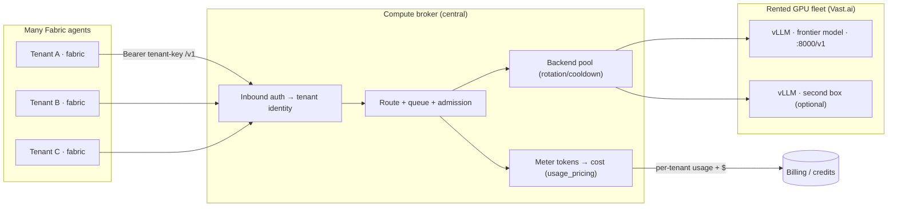

# Shared frontier-model compute broker (design)

:::caution Design + roadmap, with working pieces
The broker **server** does not exist in the repository yet. What *does* exist is
most of its substrate: an OpenAI-compatible forwarder, a credential pool with
rotation and cooldowns, and a full usage/cost engine. This page specifies the
broker on top of those, and ships a **real Vast.ai + vLLM bootstrap** you can run
today under [`deploy/compute-broker/`](https://github.com/ObliviousOdin/fabric/tree/main/deploy/compute-broker).
:::

## The goal

Rent **one large GPU machine** (cheap on [Vast.ai](https://vast.ai) or a Hetzner
/ Vultr GPU box), run a **latest open-source frontier model** on it with
[vLLM](https://docs.vllm.ai), and let **many users share that compute** through a
central endpoint — each charged a low price based on **how much they actually
use**. A user's Fabric agent (local or hosted) points its model route at the
broker and never touches the GPU directly.



## Why this is mostly assembly, not invention

Fabric already ships the three hardest pieces of a metered inference broker.

### 1. An OpenAI-compatible forwarder — the [subscription proxy](/user-guide/features/subscription-proxy)

`fabric proxy start` runs a local server (`:8645`) that exposes any provider as
an OpenAI-compatible `/v1` endpoint, **strips the client's inbound
`Authorization`**, and **attaches the real upstream credential** per request,
preserving SSE streaming. Its plug-in contract is the `UpstreamAdapter` ABC:

```python
# fabric_cli/proxy/adapters/base.py
class UpstreamAdapter(ABC):
    @property def name(self) -> str: ...
    @property def display_name(self) -> str: ...
    @property def allowed_paths(self) -> FrozenSet[str]: ...   # e.g. {/chat/completions, /models}
    def is_authenticated(self) -> bool: ...
    def get_credential(self) -> UpstreamCredential: ...        # bearer + base_url
    def get_retry_credential(self, *, failed_credential, status_code): ...  # 401/429 rotation hook
```

A **vLLM backend is a drop-in adapter**: return an `UpstreamCredential(bearer=<vllm
key>, base_url="http://gpu-host:8000/v1")`. Register it in
`fabric_cli/proxy/adapters/__init__.py`. The forwarder, path allow-listing,
streaming, and the 401/429 retry seam come for free.

### 2. A key/backend pool — [credential pools](/user-guide/features/credential-pools)

`agent/credential_pool.py`'s `CredentialPool` already does what a broker's
backend layer needs: health-aware **selection** across N entries
(`round_robin` / `least_used` / `fill_first` / `random`), **exhaustion cooldowns**
(429 → 1 h, provider-honored `reset_at`), terminal-`DEAD` quarantine, and a
**lease/return** protocol (`acquire_lease` / `release_lease`) with a per-entry
concurrency cap. Point it at *backends* (vLLM boxes) instead of provider keys and
you have fleet load-balancing and failover for a pool of GPU machines.

### 3. A usage → cost engine — [insights](/user-guide/features/web-dashboard)

`agent/usage_pricing.py` is a standalone rating library: `normalize_usage()`
canonicalizes Anthropic/OpenAI/Codex usage (input/output/**cache**/reasoning
tokens); `estimate_usage_cost()` multiplies by a maintained per-model rate table;
`CostStatus`/`CostSource` already distinguish estimated vs actual vs
subscription-included. `SessionDB.update_token_counts()` writes canonical token
buckets, `api_call_count`, provider/base-URL/billing-mode, cost, and — critically
— a **`user_id`** column. The `/api/analytics/*` endpoints roll it up by day and
model.

## The broker link on the tenant side (works today)

A tenant's Fabric points at the broker as a **custom OpenAI-compatible provider** —
no Fabric code change. In `~/.fabric/config.yaml`:

```yaml
model:
  provider: custom
  base_url: https://broker.fabric.example/v1
  default: <frontier-model-id>
  api_key: ${BROKER_TENANT_KEY}        # kept in ~/.fabric/.env
```

or, for routing metadata, a named entry with a **tenant token in a header** (the
proxy path deliberately never logs `extra_headers`):

```yaml
custom_providers:
  - name: fabric-broker
    base_url: https://broker.fabric.example/v1
    key_env: BROKER_TENANT_KEY
    extra_headers:
      X-Fabric-Tenant: ${BROKER_TENANT_ID}
```

`resolve_runtime_provider()` is the single seam that turns this into a live route,
so **any** server implementing `/v1/chat/completions` is a valid broker — vLLM,
SGLang, or the broker in front of them. Pin the agent to only the broker's
address space with `security.egress_mode: local_ai`.

## Serve the model: Vast.ai + vLLM (ships now)

[`deploy/compute-broker/`](https://github.com/ObliviousOdin/fabric/tree/main/deploy/compute-broker)
contains a runnable bootstrap:

- **`vast-vllm-onstart.sh`** — a Vast.ai *on-start* script that launches vLLM
  serving your chosen frontier open model, OpenAI-compatible on `:8000`, with
  tool-calling enabled and `--max-model-len 65536` (Fabric needs **≥ 64k**
  effective context for agentic/tool use), guarded by a bearer key.
- **`docker-compose.vllm.yml`** — the same, self-hosted on any CUDA box via the
  official `vllm/vllm-openai` image.

Point one tenant straight at that box to validate the model, then insert the
broker in front to add auth, metering, and multi-tenant routing.

## What the broker server adds (the new service)

Everything below attaches at an **existing seam** — none of it is a rewrite:

| Broker capability | Build on | New work |
| --- | --- | --- |
| **Inbound auth → tenant** | The proxy currently *discards* the inbound bearer | Validate the bearer, map it to a `tenant_id` (issue keys like `fabric auth`/`API_SERVER_KEY`) |
| **Backend routing/failover** | `CredentialPool.select` / `acquire_lease` over vLLM boxes | Weighted/health-based selection; admission control + queue |
| **Metering** | Wrap the `handle_proxy` streaming loop; parse the OpenAI `usage` block; `normalize_usage` + `estimate_usage_cost` | A **per-request ledger** table (ts, tenant, model, token buckets, cost) — today usage is per-*session* only |
| **Billing** | `usage_pricing` gives cost; `user_id` exists | Credits/quota/markup, calendar-period rollup, idempotent metering events → Stripe |
| **Multi-replica state** | `auth.json` flock is single-host | Move pool + ledger to Postgres for HA |
| **TLS / process mgmt** | none (HTTP, foreground) | Reverse proxy + systemd/container (same as [self-hosting](/deploy/self-hosting)) |

### Metering and billing {#metering-and-billing}

The honest state of metering, so a biller is built on facts:

- **Granularity is per-session, not per-request.** The `sessions` table
  aggregates tokens/cost; individual API calls are logged but not persisted as
  rows. A broker needs a new **events/ledger** table for per-call, per-tenant
  billing and dispute resolution.
- **Cost is estimated, not reconciled.** `actual_cost_usd` and the
  `provider_cost_api` source exist in the schema but no code fetches real billed
  cost. For a **self-hosted** model that is the correct model anyway: your cost is
  the GPU-hour rate, and you price tenants on **tokens served** using
  `usage_pricing` as the rate engine (set your own per-model rates + markup).
- **`user_id` is captured but never grouped on.** Per-tenant rollups are new
  queries mirroring the existing `GROUP BY day / model` in `/api/analytics/usage`.
- **No credits/quota/markup layer** exists — `model_cost_guard` is a static
  per-call warning, not an enforced budget. That layer is the broker's.

### Scale-to-zero {#scale-to-zero}

For a *messaging*-style broker of many idle tenant gateways, Fabric already has
the primitive: the experimental **relay connector** (`fabric gateway enroll` +
`GATEWAY_RELAY_*`) lets many gateways dial one connector over a single
WebSocket, and `gateway/scale_to_zero.py` suspends idle relay-only gateways
(Fly `autostop: suspend` + a `wakeUrl`) so they cost nothing until work arrives.
The **connector/broker server itself is not in the repo** and is gated behind the
`nous` provider — treat it as a reference design for the messaging path, distinct
from the *inference* broker described here.

## Build order (roadmap)

1. **Serve one model (done).** `vast-vllm-onstart.sh` → a frontier model on a GPU
   box. Point one tenant at it as a `custom` provider.
2. **vLLM `UpstreamAdapter`.** Add an adapter so `fabric proxy start` fronts the
   vLLM box; exposes the `/v1` path allow-listing and 401/429 retry for free.
3. **Multi-backend pool.** Back the adapter's `get_credential`/`get_retry_credential`
   with a `CredentialPool` of vLLM boxes for load-balancing + failover.
4. **Inbound auth + tenant identity.** Stop discarding the inbound bearer; map it
   to a tenant. Issue/rotate tenant keys.
5. **Per-request ledger + metering.** New events table; parse `usage`; rate with
   `usage_pricing`; per-tenant rollups.
6. **Billing + quotas.** Credits, markup, spend caps, Stripe metering events.
7. **HA.** Postgres-backed pool + ledger; multiple broker replicas.

---

**Related:** [Subscription proxy](/user-guide/features/subscription-proxy) ·
[Credential pools](/user-guide/features/credential-pools) ·
[Providers (vLLM/SGLang/custom)](/integrations/providers) ·
[Configuring models](/user-guide/configuring-models) ·
[Managed hosting](/deploy/managed-hosting)
