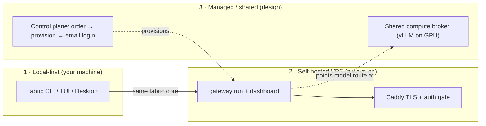

# Run Fabric on your PC — or host it

Fabric is **local-first**: the fastest, most private way to run it is on your own
machine. But an agent is most useful when it is *always on* — answering messages,
running scheduled work, and holding durable memory even when your laptop is
closed. That is what hosting adds.

This section lays out the full spectrum, from "one command on your laptop" to a
managed, click-to-deploy offering, and is explicit about **what works today**
versus **what is a design/roadmap**.

## Pick your path

| You want to… | Path | Status |
| --- | --- | --- |
| Try Fabric, keep everything on your own device | **[Install locally](/getting-started/installation)** | ✅ Works today |
| Keep an agent always-on for messaging, cron, and memory | **[Self-host on a VPS](/deploy/self-hosting)** | ✅ Works today (self-service) |
| Click "deploy", pay in one place, get login by email | **[Managed hosting](/deploy/managed-hosting)** | 🧭 Design / staged |
| Run a big open frontier model once, shared across many users | **[Shared compute broker](/deploy/compute-broker)** | 🧭 Design / staged |

:::note Honest staging
Fabric labels capabilities it cannot yet enforce as *staged backend work* rather
than shipping mockups. The homepage says the same about hosted tenancy. The two
"Design / staged" pages below are architecture and roadmap grounded in the real
runtime — they describe how the managed product is built, and ship the
**working self-service pieces** you can use right now, but they do not pretend a
billing/provisioning control plane exists yet.
:::

## The three ways to run Fabric

Every path runs the **same Fabric core** — the same profiles, skills, memory,
gateway, and dashboard. Hosting changes *where* the process lives and *who keeps
it running*, not what the agent is.

### 1. Local-first (your machine)

Install with one command and run in the terminal, TUI, or Desktop app. State
lives under `~/.fabric` (`%LOCALAPPDATA%\fabric` on Windows). No server, no
account, nothing leaves your device except the model calls you configure.

→ [Install Fabric](/getting-started/installation) · [Quickstart](/getting-started/quickstart)

### 2. Self-hosted VPS (always-on)

Put the same runtime on a small cloud box ($4–10/mo) so your agent keeps
answering Telegram/Discord/Slack, runs [cron](/user-guide/features/cron) jobs,
and keeps memory warm 24/7. Fabric ships a Docker image
(`ghcr.io/obliviousodin/fabric`) and this section adds ready-to-use
[deploy templates](/deploy/self-hosting) — a hardened Compose file, a Caddy TLS
reverse proxy, an unattended provisioner, and cloud-init for a one-paste VPS
bring-up.

→ [Self-host on a VPS](/deploy/self-hosting)

### 3. Managed hosting & shared compute (design)

The vision behind this section: from the website, a user picks a provider
(Hetzner, DigitalOcean, a shared GPU pool, …), pays in one place, clicks
**Deploy**, and receives an email with a login — their agent is already running.
Separately, Fabric can rent one large GPU box (e.g. on Vast.ai), serve a
frontier open-source model with vLLM, and **share that compute across many
users**, metered so each pays only for what they use.

Both are designed on top of primitives Fabric already has — unattended config
seeding, the fail-closed dashboard auth gate, self-hosted OIDC "email login",
the OpenAI-compatible subscription proxy, credential pools, and the usage/cost
engine. The two design pages walk the architecture, the reuse map, and the
build order.

→ [Managed hosting control plane](/deploy/managed-hosting) ·
[Shared compute broker](/deploy/compute-broker)

## What ships in this section

Under [`deploy/`](https://github.com/ObliviousOdin/fabric/tree/main/deploy) in
the repository:

- `docker-compose.hosted.yml` + `Caddyfile` — an always-on gateway + dashboard
  behind automatic HTTPS with the auth gate enforced.
- `provision.sh` — unattended, non-interactive config seeding: generates a
  dashboard login + a strong API key, writes `config.yaml`/`.env`, and emits a
  credentials summary (the artifact a managed control plane would email).
- `cloud-init.yaml` — paste into a fresh Ubuntu VPS's user-data to install
  Docker, drop the templates, provision, and start — the self-service version of
  "click to deploy".
- `compute-broker/` — a Vast.ai + vLLM bootstrap and the broker wiring that lets
  one GPU box back many tenants.

Continue to [Self-host on a VPS](/deploy/self-hosting) to stand one up.
