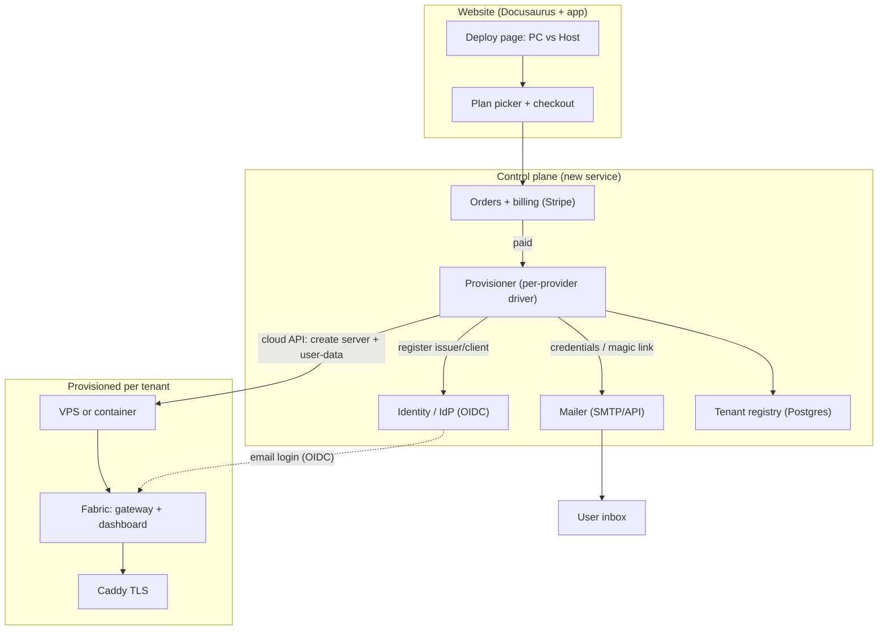
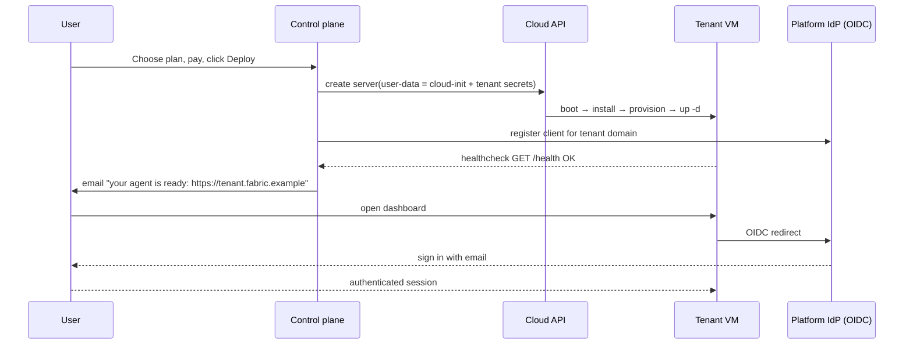

# Managed hosting control plane (design)

:::caution This is a design + roadmap, not a shipped product
There is **no billing or provisioning control plane in the repository today**.
This page specifies how one is built on top of the runtime Fabric already has,
and points at the [working self-service pieces](/deploy/self-hosting) that are
its foundation. It follows the project's convention of describing staged backend
work honestly rather than shipping a mockup.
:::

## The goal

From the website, a user should be able to:

1. **Sign up** and choose **Install on my PC** or **Host it for me**.
2. If hosting: pick a **provider/plan** (Hetzner, DigitalOcean, Vultr, a shared
   GPU pool, …), **pay in one place**, and click **Deploy**.
3. Receive an **email with a login** (URL + username/password, or an SSO link).
4. Land in a **running agent** — their Fabric is already set up.

That is a thin, opinionated wrapper around the exact steps
[`cloud-init.yaml` + `provision.sh`](/deploy/self-hosting) already perform. The
control plane's job is to run them *for* the user, take payment, and deliver the
credentials.

## Architecture

The control plane is a **new, small service**. Everything inside the "Fabric:
gateway + dashboard" box already exists.

## What Fabric already provides (the reuse map)

| Control-plane need | Existing Fabric primitive | Where |
| --- | --- | --- |
| Unattended install | `install.sh` one-liner with `--non-interactive` | [`scripts/install.sh`](https://github.com/ObliviousOdin/fabric/blob/main/scripts/install.sh) |
| Headless config seeding | `.env` + `config.yaml` (or `fabric config set`); any provider key makes Fabric usable with no wizard; `${VAR}` interpolation keeps secrets in `.env` | [`provision.sh`](/deploy/self-hosting#what-provisionsh-does) |
| Always-on service | `fabric gateway run` (supervised) / `gateway install` (systemd) / Docker `--restart` | [Docker](/user-guide/docker) |
| Safe public exposure | Fail-closed [auth gate](/user-guide/features/web-dashboard): loopback = trusted, non-loopback = **must** have an auth provider | `web_server.py` |
| Password login | `dashboard.basic_auth` (scrypt hash, HMAC sessions, optional TOTP) | `plugins/dashboard_auth/basic` |
| **Email login / SSO** | `dashboard.oauth.self-hosted` generic OIDC — maps the OIDC `email` claim to a session (Keycloak/Authentik/Auth0/Okta/Google) | `plugins/dashboard_auth/self_hosted` |
| Machine-to-machine auth | `API_SERVER_KEY` bearer + `token_auth` seam | [API server](/user-guide/features/api-server) |
| Per-tenant state root | `FABRIC_HOME` (honored by 100+ call sites) + [profiles](/user-guide/profiles) | `fabric_constants.py` |
| Fleet policy pinning | [Managed scope](/user-guide/managed-scope) `/etc/fabric` (wins over user config *and* env, per key) | `fabric_cli/managed_scope.py` |
| Reproducible tenant setup | `fabric profile export/import`, `fabric profile install <git-url>` | `fabric_cli/profiles.py` |

The single most important fact: **provisioning is entirely file/env driven and
needs no interactive wizard.** A deploy pipeline writes `.env` + `config.yaml`
and starts two processes — which is exactly what `provision.sh` does.

## The "email login" question, answered

Fabric has no built-in SMTP or magic-link minting — the box never emails anyone.
There are two clean ways the control plane delivers a login:

- **Password login (simplest).** The provisioner generates a password and the
  control plane emails it (from its own mailer), exactly like the
  `fabric-credentials.txt` file cloud-init writes. Good for single-owner boxes.
- **OIDC "email login" (recommended, real SSO).** The platform runs **one
  identity provider** (Keycloak/Authentik/Auth0/…). Every tenant's dashboard is
  configured with `dashboard.oauth.provider: self-hosted` pointing at that IdP.
  The user signs in with their email; the OIDC `email` claim becomes their
  session identity. No per-box passwords to manage, and it is the same seam a
  multi-tenant product needs for real per-user accounts.

## Provider matrix

The provisioner is a thin per-provider driver behind one interface: *create a
box, hand it the tenant's cloud-init, wait for `GET /health`, register DNS +
OIDC client.*

| Target | Driver | Notes |
| --- | --- | --- |
| Hetzner Cloud | `hcloud` API: create server + `user_data` | Cheapest; best default |
| DigitalOcean | Droplets API: `user_data` | One-click Docker images |
| Vultr / Contabo | Provider API + cloud-init | More RAM/storage per dollar |
| Fly.io | Machines API + `fly.toml` | Suspends idle machines to zero (see the [relay/scale-to-zero](/deploy/compute-broker#scale-to-zero) primitive) |
| Shared GPU (Vast.ai) | Not a per-tenant VM — the [compute broker](/deploy/compute-broker) | For frontier local models |

Because the unit of deploy is "a box + a cloud-init", adding a provider is
writing one driver, not re-architecting.

## Tenancy with profiles {#tenancy-with-profiles}

For **one tenant per box**, `FABRIC_HOME` = the box and there is nothing more to
do. To pack **several tenants on one box** (cheaper tiers), Fabric's
[profiles](/user-guide/profiles) are the native unit: each profile is its own
`FABRIC_HOME` with isolated config, `.env`, memory, sessions, skills, and its own
supervised gateway (`fabric-gateway-<name>` / an s6 slot in the container). The
[managed scope](/user-guide/managed-scope) layer lets the control plane **pin**
per-fleet policy (model provider, base URL, `redact_secrets`) immutably above the
tenant's own config.

:::warning A profile is not yet a security boundary
This is the honest ceiling. Fabric's own docs state a profile **is not a tenant,
team, role, or billing boundary** — all profiles run as the same OS user, share
`HOME` (and thus `git`/`ssh` creds) by default, and the cross-profile guard is
"not a security boundary". For **strong** multi-tenant isolation, put one tenant
per VM or per container (a real OS/kernel boundary), and treat the profile model
as a same-trust convenience for a single customer's several agents. The missing
pieces — an authoritative tenant actor, RBAC, and per-tenant resource isolation —
are the staged backend work below.
:::

## Build order (roadmap)

A pragmatic sequence, each step shippable on its own:

1. **Self-service (done, this section).** cloud-init + Compose + Caddy +
   `provision.sh`. A user can host today.
2. **`fabric setup --seed <manifest>`.** Turn `provision.sh`'s logic into a
   first-class, manifest-driven unattended provisioning mode in the CLI, so the
   control plane calls one supported command instead of a shell script. *(New CLI
   surface — the clean seam is the existing non-interactive setup path.)*
3. **Control-plane MVP.** A small service: Stripe checkout → Hetzner driver →
   pass tenant secrets as cloud-init → poll `GET /health` → email the login.
   One provider, password login, one tenant per box.
4. **OIDC email login.** Stand up the platform IdP; provisioner registers a
   client per tenant domain; dashboards use `dashboard.oauth.self-hosted`.
5. **Tenant registry + lifecycle.** Postgres of tenants/boxes/subscriptions;
   suspend on non-payment, resume, destroy, backups (`fabric profile export`).
6. **Real tenancy (backend contract).** Authoritative tenant actor, server-
   enforced RBAC/capabilities, per-tenant resource isolation and quotas — the
   items the runtime docs already name as staged. Until these land, isolation is
   "one VM/container per tenant".

## Gaps to close (tracked honestly)

- No fully-unattended `fabric setup` yet — the control plane seeds config itself
  (step 2 fixes this).
- No in-box email; the control plane owns delivery.
- No user database / signup / invite / password-reset in the runtime — OIDC or
  the control plane owns identity.
- No per-tenant metering or quotas in the runtime (see the
  [compute broker](/deploy/compute-broker#metering-and-billing) for the usage
  engine that exists and what a biller must add).
- Profiles are not a hard boundary; strong isolation = one VM/container each.

---

**Related:** [Self-hosting](/deploy/self-hosting) ·
[Web dashboard & auth](/user-guide/features/web-dashboard) ·
[Managed scope](/user-guide/managed-scope) · [Profiles](/user-guide/profiles) ·
[Shared compute broker](/deploy/compute-broker)
