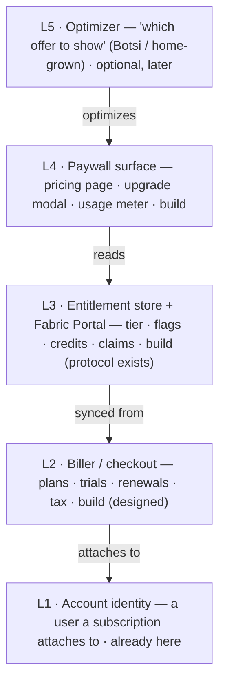
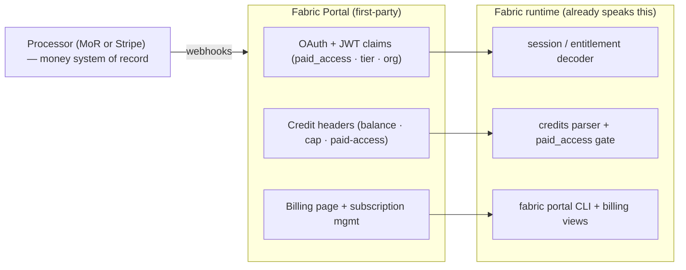
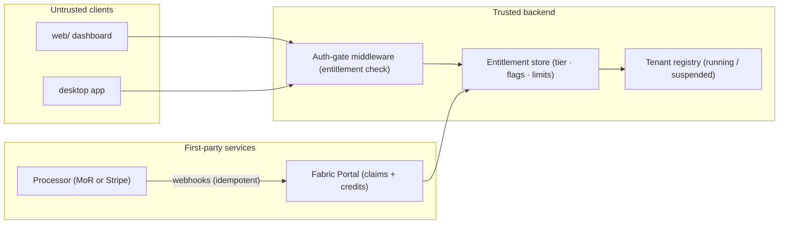

# Paywall & monetization (ideation)

:::caution This is ideation + roadmap, not a shipped product
There is **no first-party billing, checkout, or Fabric-owned entitlement portal
in the repository today.** This page reasons about how a paywall is built on the
runtime Fabric already has, and how a Botsi-style AI pricing/paywall layer would
(and would not) fit. It follows the project's convention of describing staged
backend work honestly rather than shipping a mockup. It builds directly on the
[managed hosting](/deploy/managed-hosting) and [compute broker](/deploy/compute-broker)
designs — read those first.
:::

## The question

Can something like [Botsi](https://www.botsi.com) — an AI layer that shows the
right price and paywall to each user — be incorporated into the Fabric page to
get a paywall option?

**Short answer: yes, you can put a paywall on Fabric's hosted offering — but a
Botsi-style layer is the _last_ brick, not the first.** It is a decision-only
optimizer that presupposes a billing + entitlement + paywall stack. Fabric
already ships most of the _protocol_ for that stack (credits, `paid_access`,
billing views) — it just needs to be re-homed behind a **first-party Fabric
Portal** instead of the legacy Nous integration. Build that foundation first,
monetize the **service** rather than the Apache-2.0 core, and treat an AI pricing
layer as an optional, removable add-on to revisit only once a hosted funnel
produces real volume.

## Why Botsi is not a paywall

Botsi is a **decision layer, not a paywall and not a biller.** It trains a
per-app model that, at the moment a user hits a paywall, returns _which_
offer/price/variant to show. Its own positioning: it "sits on top of your
existing stack (RevenueCat / Superwall / internal infrastructure) and tells it
which paywall to show." It never renders your UI, never charges a card, and
never stores who-is-allowed-what.

It is also oriented at high-volume **mobile in-app-purchase** funnels (App Store
/ Play), priced as a percentage of subscription revenue, and its reinforcement
learning needs far more conversions than a high-value developer tool produces
early on. Fabric is a globally-sold web / desktop / CLI tool billed via a card
processor, not IAP.

:::note Verify Botsi's specifics before relying on them
`botsi.com` returns `403` to automated fetching, so its endpoint names, model
details, and price figures in any ideation come from search snippets and
third-party write-ups. Confirm against live docs before building on them.
:::

Two frictions worth naming up front:

- **Trust.** Showing different users different prices is an arbitrage and
  fairness hazard for a transparency-first technical audience.
- **Values.** A Botsi-style model's quality depends on streaming per-user
  behavioral signals to a third-party SaaS, which cuts against Fabric's
  local-first, privacy-respecting posture. Keep the OSS / self-hosted path
  optimizer-free regardless.

## A paywall is a layer cake

Every layer has to exist before the one above it means anything. Fabric already
has the bottom of the cake, and most of the plumbing for the middle.

A Botsi-style layer is **L5**. Fabric has **L1**, a design for **L2**, and — the
happy surprise — most of **L3's protocol** already in-tree. The load-bearing work
is standing up the first-party portal behind that protocol and building **L4**.

## What Fabric already provides (the reuse map)

This is not a green field. A working `paid_access` gate and a full credits
protocol already ship in-tree — today pointed at a legacy portal, and exactly the
shape a first-party Fabric Portal re-homes.

| Foundation need | Existing Fabric primitive | Where |
| --- | --- | --- |
| Account identity a subscription can attach to | Fail-closed dashboard [auth gate](/user-guide/features/web-dashboard); OIDC "email login" and basic-auth both resolve a verified session | `plugins/dashboard_auth/self_hosted`, `plugins/dashboard_auth/basic` |
| A proven credits + entitlement architecture (in-tree) | A `paid_access` capability gate with upgrade copy ("Add credits or a subscription… at {billing_url}"), a hardened credit-header parser (micros money, subscription cap, purchased/rollover, depletion → `paid_access`), and terminal billing views. Re-home behind a first-party [Fabric Portal](#fabric-portal) | `agent/credits_tracker.py`, `agent/billing_view.py`, `agent/account_usage.py` |
| An entitlement-claims decoder | Decodes `paid_access`, `subscription_tier`, `org_id` from a session JWT | `fabric_cli/nous_account.py` (generalize to a Fabric Portal issuer) |
| A single enforcement chokepoint | Middleware attaches a verified session to every non-public request; a latent capability field (`Principal.scopes`) is defined but not yet enforced by any route | `fabric_cli/dashboard_auth/middleware.py`, `fabric_cli/dashboard_auth/base.py` |
| A portal onboarding + subscription CLI | `fabric portal` (OAuth login, pick model, open subscription page); portal URL is already config-driven | `fabric_cli/portal_cli.py` (`NOUS_PORTAL_BASE_URL`, `dashboard.oauth.portal_url`) |
| A usage → cost engine | `normalize_usage()` + `estimate_usage_cost()` over a maintained per-model rate table | `agent/usage_pricing.py` |
| Per-session usage records | Sessions table records `user_id`, `billing_mode`, estimated/actual cost, `api_call_count`, token buckets — **per session**, cost **estimated** | `fabric_state.py` (repo root) |
| A control-plane design | Plan picker → checkout → provisioner → Postgres tenant registry with suspend / resume / destroy | [`deploy/managed-hosting`](/deploy/managed-hosting) |
| A metered-inference design | Shared-GPU broker, metered on tokens served, built on the proxy + credential pool + `usage_pricing` | [`deploy/compute-broker`](/deploy/compute-broker) |
| Fleet policy pinning | [Managed scope](/user-guide/managed-scope) `/etc/fabric` wins over user config and env, per key — the right place to pin per-tier caps | `fabric_cli/managed_scope.py` |

:::note The legacy portal coupling is what you replace
Today this credits/entitlement stack is sourced from a legacy **Nous Portal**
integration (`plugins/dashboard_auth/nous`, `fabric_cli/portal_cli.py` default,
`fabric_cli/proxy/adapters/nous_portal.py`, the `x-nous-credits-*` header
protocol). The plan is to **retire that coupling** and re-home the same,
already-factored protocol behind a first-party Fabric Portal (below) — not to
build billing from scratch, and not to keep Nous in the loop.
:::

## A Fabric-native portal — the Nous shape, made first-party {#fabric-portal}

The most valuable thing in the tree is not billing code — it is a billing
**protocol** Fabric already speaks end-to-end, currently pointed at Nous. Making
it Fabric-native means standing up a first-party **Fabric Portal** that plays the
same three roles, backed by your own processor:

1. **Claims issuer.** OAuth login that mints session JWTs carrying entitlement
   claims — `paid_access`, `subscription_tier`, `org_id`, plan. `nous_account.py`
   already decodes exactly these claims; a Fabric Portal issues them from your own
   subscription state instead of Nous's.
2. **Metered-credits protocol.** The inference path emits credit headers —
   remaining balance in micros, subscription cap, purchased/rollover, a
   `paid-access` flag, a `disabled-reason`, an `as-of-ms` stamp. `credits_tracker.py`
   already parses this whole schema — re-namespace the `x-nous-credits-*` prefix to
   a Fabric (or provider-neutral) one and the parser, depletion gate, and
   subscription-cap math come along unchanged.
3. **Billing surface.** The `{billing_url}` in every upgrade prompt, the
   `fabric portal` onboarding CLI, and the terminal billing screens
   (`billing_view.py`, `account_usage.py`) already exist — re-point them at the
   Fabric billing page.

Behind the Portal, a real processor (merchant-of-record or Stripe) is the money
system-of-record; the Portal's only job is to translate subscription and credit
state into the JWT claims and inference headers Fabric already understands. The
portal endpoint is **already configurable** (`NOUS_PORTAL_BASE_URL`,
`dashboard.oauth.portal_url`), so re-homing the issuer is a config + re-namespace
migration, not a rewrite of the client.

:::warning De-Nous-ing is a real but bounded migration
The Nous coupling is broad — 100+ files across `agent/` and `fabric_cli/`
reference it. But the credits/entitlement **protocol** is well-factored into
dataclasses and parsers, and the portal URL and OAuth client are already
config-driven, so the path is **re-home the issuer + re-namespace `nous_*` →
`fabric_*` + retire the Nous-branded provider and defaults** — not a rewrite of
the client logic. Scope this as its own migration workstream feeding Phase 2.
:::

## What is paywallable — and what is not

Fabric's core is **Apache-2.0**: the grant is perpetual and irrevocable
(`LICENSE` §2). You cannot paywall code already in the open tree — anyone can
fork the last commit and host it free. Monetize the **service** and **new,
separable proprietary modules** (the Fabric Portal is one), never the existing
software.

| Tier | What it includes | Why it is legitimate |
| --- | --- | --- |
| **Free** | Local self-host, CLI, desktop, all auth, profiles, local-first state, local models | Already open and forkable; the adoption engine. Gating anything in the open tree only invites a fork. |
| **Managed hosting** *(monetize first)* | Click-to-deploy, per-tenant VM/container, uptime, no-ops convenience | "We run it for you" is squarely allowed (§9) and matches every open-core precedent. Enforced by provisioning state, not a client flag. |
| **Enterprise add-ons** *(monetize first)* | SSO/SAML, org RBAC, audit logs, fleet-policy management, seats; plus SLA support, warranty/indemnity | The reliably-paywalled open-core set, authored as **new proprietary modules** (separable works §1 lets you keep closed). §9 explicitly permits charging for support/warranty/indemnity. |
| **Pro** *(later)* | More agents/profiles, cron/automations, channels, full insights, premium model routes | Natural per-plan levers that map to real dashboard routes an entitlement check can gate for the hosted tier. |
| **Metered compute** *(later)* | Shared-GPU usage billed on tokens served | Genuinely usage-metered and network-served. Needs the per-request ledger below before billing on it. |

:::note Backlash tracks moving the line, not charging
Never gate a capability already shipping in the Apache-2.0 tree. Relicensing the
existing core (Commons Clause / BSL / SSPL) is both pointless (the grant is
irrevocable) and the single reliable trigger for forks and reputational damage
(Terraform, Elastic, Redis). If you want anti-reseller protection, apply a
source-available license **only to brand-new modules** (e.g. the Fabric Portal),
accepting the "not open source" perception cost. Get IP/licensing counsel before
any dual-licensing decision, and clear the "Fabric" trademark (vs Microsoft
Fabric and `danielmiessler/fabric`) before building a commercial identity on the
name.
:::

## Where a paywall wires in

1. **Enforcement chokepoint.** Add a per-account entitlement lookup where the
   auth middleware already attaches a verified session, or start enforcing the
   existing `Principal.scopes`. One file, fail-closed. Reuse the shipped
   `paid_access` gate (re-homed to the Fabric Portal). Keep every processor /
   optimizer key server-side — `web/` and the desktop client are tamperable.
2. **Billing → entitlement sync.** Processor webhooks (created / updated /
   canceled) reach the **Fabric Portal**, which updates the entitlement store and
   mints the `paid_access` / tier claims Fabric already reads. Treat "paid" and
   "unlocked" as two facts; make handlers idempotent and add a reconciliation job
   to kill paid-but-locked / churned-but-unlocked drift.
3. **Hosted = lifecycle is enforcement.** For the hosted tier, the
   [tenant registry](/deploy/managed-hosting#tenancy-with-profiles) running /
   suspended / destroyed state _is_ the paywall — a non-paying tenant is
   suspended at the infra layer. Strong isolation is one VM/container per tenant;
   profiles are explicitly **not** a security or billing boundary.
4. **Metered compute ledger (later).** Upgrade usage from per-session to a
   per-request ledger, group on the existing `user_id`, and add a
   credits/quota/markup layer with a **soft** cap that warns before a **hard**
   cap. The rate math exists in `agent/usage_pricing.py`; `fabric_cli/model_cost_guard.py`
   is only a warning today and must become an enforced budget.
5. **Paywall UI.** A static pricing page on the Docusaurus site → external
   checkout; an in-app upgrade modal + usage meter beside the auth widget,
   reading `/api/analytics/usage`; a reverse-trial banner. Drive all gates off
   the server flag so tiers are A/B-testable without shipping client code.

## Choosing a processor (open decision)

| Option | Trade-off |
| --- | --- |
| **Merchant-of-record** (Polar, Lemon Squeezy, Paddle) | The MoR becomes the legal seller and handles global VAT/GST/sales-tax for ~2% more. Best fit for a small team with no finance function. Recommended default. |
| **Stripe-direct** | Cheaper and full control, but **you** become merchant-of-record and owe global tax registration and remittance yourself (Stripe Tax only calculates). Better if usage-based metering dominates. |

This is left open pending the flat-vs-usage decision. For a first move built on
**managed hosting + enterprise add-ons** (flat/seat pricing), a merchant-of-record
is the lower-operational-burden choice; revisit if metered compute becomes the
primary line. Either way it sits **behind** the Fabric Portal, so it can be
swapped without touching the client protocol.

## Build order (roadmap)

Tailored to monetizing **managed hosting + enterprise add-ons first.** Each phase
ships on its own; a Botsi-style optimizer does not appear until the funnel earns
it.

1. **Phase 0 — Decide & publish the shopfront.** Written decision on what is
   gated; processor choice; an honest pricing page labeled "design/roadmap" per
   this repo's convention; IP counsel and trademark clearance.
2. **Phase 1 — Enterprise add-ons.** SSO/OIDC already exists
   (`plugins/dashboard_auth/self_hosted`); author RBAC (enforce `Principal.scopes`),
   audit logs, and fleet-policy management as **new proprietary modules** kept out
   of the OSS tree. These are the highest-ACV, lowest-volume, lowest-licensing-risk
   revenue and can precede full self-service billing (early deals can be invoiced
   manually).
3. **Phase 2 — Fabric Portal + managed-hosting billing.** Stand up the
   first-party [Fabric Portal](#fabric-portal): re-home the credits/entitlement
   protocol off the legacy Nous integration (re-namespace + retire the Nous
   provider and adapters), back it with the chosen processor, and implement
   [managed hosting](/deploy/managed-hosting) steps 3–5 (checkout → webhook →
   entitlement store → tenant registry with suspend/resume/destroy; idempotent
   webhooks + reconciliation). The entitlement check at the auth middleware reads
   the Portal's `paid_access` / tier claims.
4. **Phase 3 — Paywall UX + reverse trial.** Full features for ~14 days, then
   auto-downgrade to a capped free tier or suspend the hosted box; an in-app
   upgrade modal (explain-why + preview + one-click unlock + "continue without
   upgrading"), capped and shown at moments of value; a usage meter with a
   soft-limit banner.
5. **Phase 4 — Metered compute billing.** Per-request ledger; group billing on
   `user_id`; enforced credits/quota/markup (extend the Fabric Portal credit
   protocol); signed offline lease tokens for any paid desktop/self-install tier
   (accept it is honor-system, not DRM).
6. **Phase 5 — Optimization, only if volume justifies.** Rules-based upgrade
   triggers on Fabric's first-party signals; low-cardinality pricing-page A/B
   tests to significance. Only at **thousands of trials/month**: evaluate a
   Botsi-style web API or a home-grown bandit — removable, portal-fronted, and
   never on the OSS/self-host path.

## Risks to hold in view

- **Sequencing.** "Just add Botsi" reads as a shortcut but presupposes the very
  layers Fabric lacks; as step one it is cost before signal.
- **De-Nous migration.** Retiring the legacy portal touches 100+ files; keep it a
  bounded re-home + re-namespace of an already-factored protocol, sequenced as
  its own workstream — not a rewrite.
- **Metering honesty.** Usage is per-session and cost is estimated — billing
  before a per-request ledger makes disputes unresolvable and quotas
  unenforceable.
- **Webhook drift.** Billing ↔ entitlement desync is a classic revenue leak;
  needs idempotency + reconciliation.
- **Tenant isolation.** Profiles share the OS user, `HOME`, and git/ssh creds —
  real multi-tenant billing means one VM/container per tenant.
- **Forkability.** Any client-side gate can be stripped and the core self-hosted
  free; the moat is convenience, compute, brand, and enterprise features — not
  exclusivity over the software.

## Open decisions

- Flat tiers or usage-based? (Sets processor and pulls the per-request ledger
  earlier or later.)
- Merchant-of-record or Stripe-direct behind the Fabric Portal?
- Fabric Portal namespace + domain — a Fabric-branded protocol
  (`x-fabric-credits-*`, `paid_access`) or a provider-neutral one, hosted where?
- Is a paid desktop / self-install tier in scope? (If yes, commit to signed
  offline leases and honor-system enforcement.)
- Source-available license for new modules (incl. the Portal), or stay
  all-Apache and rely on brand/hosting as the moat?
- Does the local-first brand permit any per-user behavioral data going to a
  third-party pricing SaaS, ever?

---

**Related:** [Managed hosting control plane](/deploy/managed-hosting) ·
[Shared compute broker](/deploy/compute-broker) ·
[Self-hosting](/deploy/self-hosting) ·
[Web dashboard & auth](/user-guide/features/web-dashboard) ·
[Managed scope](/user-guide/managed-scope) · [Profiles](/user-guide/profiles)
