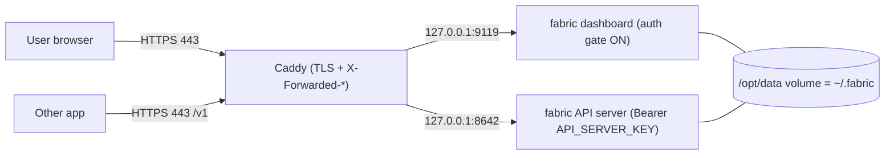

# Self-host Fabric on a VPS

This is the **works-today** path: put the same Fabric runtime on a small
always-on cloud box so it keeps answering messages, running
[cron](/user-guide/features/cron) jobs, and holding
[memory](/user-guide/features/memory) 24/7 — even when your laptop is off.

Everything here uses the templates under
[`deploy/`](https://github.com/ObliviousOdin/fabric/tree/main/deploy) in the
repository and the published image `ghcr.io/obliviousodin/fabric`.

:::info What you get
A hardened **gateway + dashboard** behind **automatic HTTPS** (Caddy), with the
non-loopback [auth gate](/user-guide/features/web-dashboard) enforced, an
OpenAI-compatible [API server](/user-guide/features/api-server) protected by a
strong key, and a generated dashboard login you can hand to yourself or a
teammate.
:::

## Pick a box

A "cheap VPS" that runs the agent plus small/cloud models comfortably is
**$4–10/mo**. The agent itself is light — 1 GB RAM works, 2 GB is comfortable
(add headroom if you enable the [browser](/user-guide/features/browser) tools).
Heavy *local* models want their own GPU box; most people run the agent on a
small VPS and point the model route at a cloud provider or the
[shared compute broker](/deploy/compute-broker).

| Provider | Good starter tier | Notes |
| --- | --- | --- |
| Hetzner Cloud | CX22 / CPX21 (2–4 vCPU, 8 GB) | Best price/performance; EU + US regions |
| DigitalOcean | Basic/Premium Droplet (2 vCPU, 8 GB) | Great docs, one-click Docker |
| Vultr | 2–4 vCPU, 8 GB | Cheap GPU add-ons if you later co-locate a model |
| Contabo | 4–6 vCPU, 8–16 GB | Most RAM/storage per dollar |

Any Ubuntu 22.04/24.04 x86-64 box works. You need a **domain name** pointed at
the box's IP so Caddy can issue a TLS certificate.

## Option A — One-paste cloud-init (fastest)

Most providers accept a **user-data / cloud-init** script when you create the
server. Paste [`deploy/cloud-init.yaml`](https://github.com/ObliviousOdin/fabric/blob/main/deploy/cloud-init.yaml),
edit the three values at the top (`FABRIC_PUBLIC_DOMAIN`, `ACME_EMAIL`, and one
model-provider key such as `OPENROUTER_API_KEY`), and create the server.

It will, unattended:

1. install Docker + the Compose plugin;
2. drop the `deploy/` templates into `/opt/fabric-deploy`;
3. run [`provision.sh`](#what-provisionsh-does) to generate a dashboard login, a
   dashboard signing secret, and an API key, and to write `config.yaml`/`.env`;
4. `docker compose -f docker-compose.hosted.yml up -d`;
5. write the credentials to `/root/fabric-credentials.txt` (mode `600`).

When it finishes, `https://your-domain` serves the login, and
`cat /root/fabric-credentials.txt` shows the username, password, and API key.

:::tip This is the self-service shape of "click to deploy"
cloud-init *is* the "provision a box and hand back a login" step, minus the
billing UI and the email. The [managed-hosting design](/deploy/managed-hosting)
describes wrapping exactly this in a control plane that runs it for the user and
emails the credentials file instead of writing it to disk.
:::

## Option B — Docker Compose by hand

On any box with Docker installed:

```bash
git clone https://github.com/ObliviousOdin/fabric.git
cd fabric/deploy

cp .env.hosted.example .env
# Edit .env: set FABRIC_PUBLIC_DOMAIN, ACME_EMAIL, and one provider key
# (e.g. OPENROUTER_API_KEY). Leave the generated-secret fields blank.

./provision.sh                       # generates login + secrets, writes config
docker compose -f docker-compose.hosted.yml up -d

cat ./fabric-credentials.txt         # your dashboard login + API key
```

`provision.sh` is **idempotent** — re-running it will not overwrite secrets that
already exist, so it is safe in a cloud-init or a redeploy.

## What `provision.sh` does {#what-provisionsh-does}

The provisioner fills the biggest gaps between "install Fabric" and "safely
expose it", entirely non-interactively (Fabric's
[`fabric setup`](/getting-started/quickstart) wizard is interactive-only, so a
hosted deploy seeds config directly, which is a supported path):

- **Dashboard login.** Generates a random password and a stable
  `dashboard.basic_auth.secret` (so sessions survive restarts and multiple
  workers), computes the scrypt `password_hash` using the image's own
  `hash_password` helper, and writes them to `config.yaml`. The auth gate is
  **mandatory** on any non-loopback bind and **fail-closed** — a misconfigured
  public dashboard refuses to start rather than exposing your keys.
- **API server.** Generates a 32-byte `API_SERVER_KEY` (`openssl rand -hex 32`)
  and enables the OpenAI-compatible [API server](/user-guide/features/api-server)
  so other apps can use your agent with a bearer token.
- **Model route.** Points the [model](/user-guide/configuring-models) at your
  chosen provider (default: OpenRouter via `OPENROUTER_API_KEY`), or at the
  [compute broker](/deploy/compute-broker) if you set `FABRIC_MODEL_BASE_URL`.
- **Credentials summary.** Writes `fabric-credentials.txt` (mode `600`) with the
  dashboard URL, username, password, and API key.

It does **not** send email — nothing in the box speaks SMTP. Delivering the
credentials to a user's inbox is the managed control plane's job (see the
[design](/deploy/managed-hosting)).

## How exposure stays safe



- **Caddy** terminates TLS for your domain and forwards `X-Forwarded-Proto/Host`
  so OAuth callbacks and `Secure` cookies resolve correctly. The dashboard has
  no native TLS by design; a reverse proxy is expected.
- The **dashboard** binds loopback *inside* the compose network; the auth gate is
  on because Caddy reaches it as a non-loopback client, and it is configured with
  the generated basic-auth login. For real per-user accounts or SSO, switch to
  the **self-hosted OIDC** provider (`dashboard.oauth.self-hosted`) — that is
  also the "email login" seam the managed design uses.
- The **API server** never starts without a strong key.

:::warning One writer per volume
Never point two gateway containers at the same `~/.fabric` / `/opt/data` — the
session and memory stores are not concurrency-safe. To run more than one agent
on a box, use [profiles](/deploy/managed-hosting#tenancy-with-profiles) or the
[multi-profile gateway](/user-guide/multi-profile-gateways) model, not a second
container on the same volume.
:::

## Day-2 operations

```bash
docker compose -f docker-compose.hosted.yml logs -f          # tail logs
docker compose -f docker-compose.hosted.yml pull && \
  docker compose -f docker-compose.hosted.yml up -d           # upgrade
docker compose -f docker-compose.hosted.yml exec fabric fabric status --deep
docker compose -f docker-compose.hosted.yml exec fabric fabric insights --days 30
```

Rotate the dashboard password by re-running `./provision.sh --rotate-password`,
or the API key with `--rotate-api-key`, then `up -d` to apply.

## Next steps

- Add a messaging channel: [Telegram](/user-guide/messaging/telegram),
  [Discord](/user-guide/messaging/discord), [Slack](/user-guide/messaging/discord).
- Point the model at a self-hosted or shared frontier model:
  [Compute broker](/deploy/compute-broker) ·
  [Providers](/integrations/providers).
- Understand the managed, click-to-deploy version:
  [Managed hosting](/deploy/managed-hosting).
